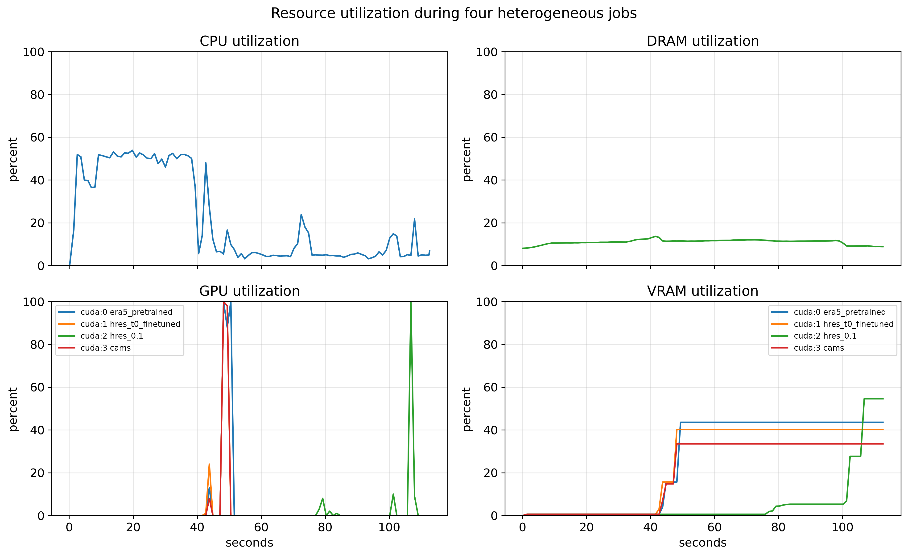
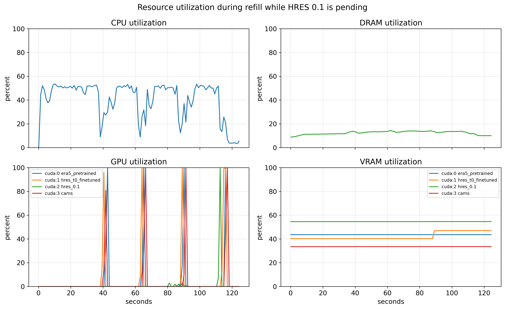
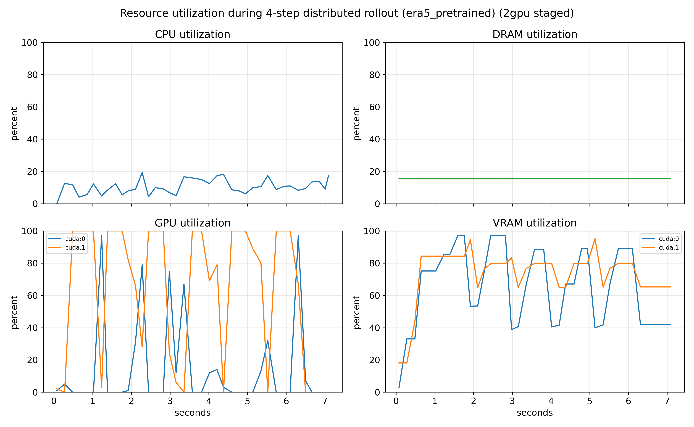
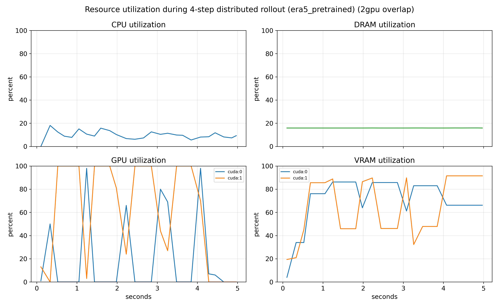
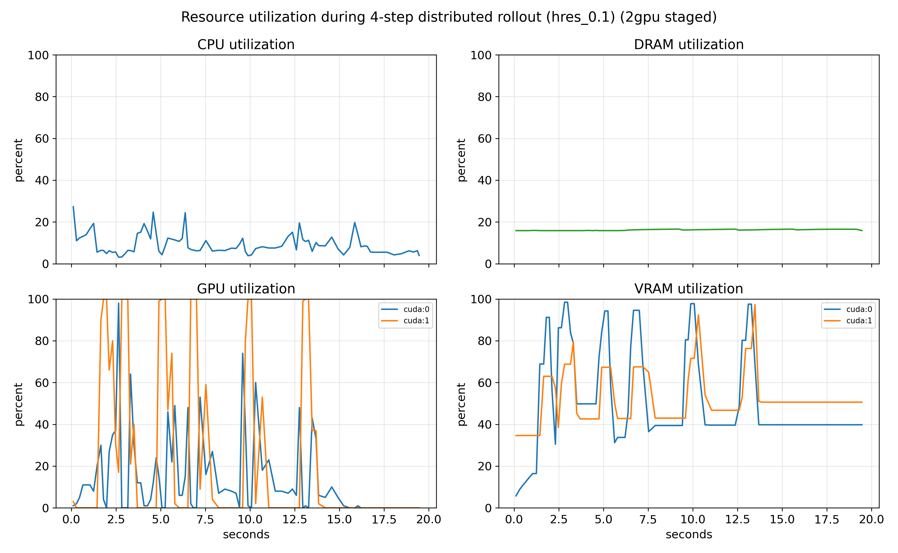
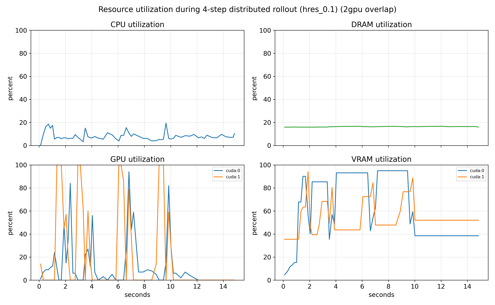
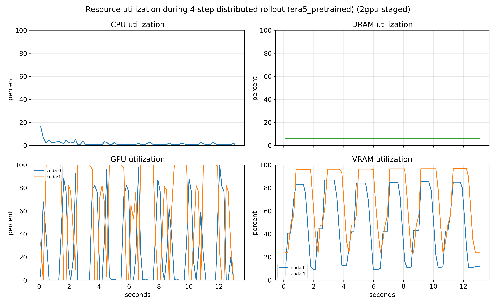
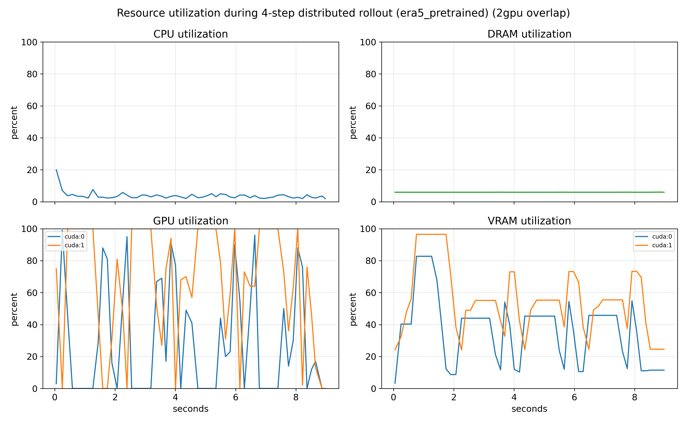
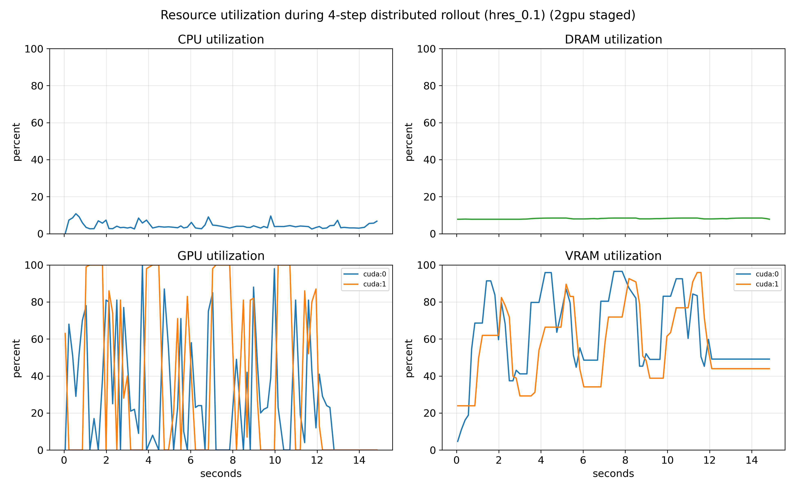
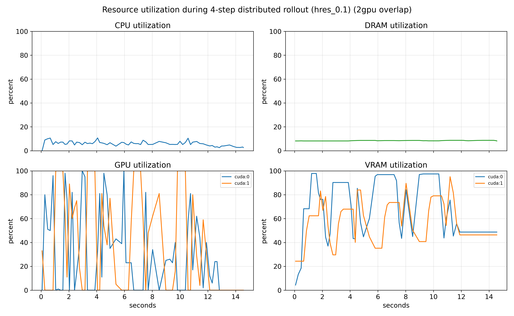

# Flash-Aurora: Toward Efficient Inference for Geospatial Foundation Models

Flash-Aurora is an inference stack for the [Microsoft Aurora](https://github.com/microsoft/aurora) Earth-system foundation model. It includes the Aurora model fork, Triton and CuTe DSL kernels, precision routing, data ingress, checkpoint loading, autoregressive rollout, NetCDF export, and a ZeroMQ scheduler for out-of-process serving.

## Highlights

### Better global memory usage

PyTorch Swin3D rollout materializes many short-lived tensors for window roll/pad/partition and for AdaLN block boundaries. Flash-Aurora fuses these on the backbone hot path with Triton (all custom precision tiers):

- **Fused window layout** (`triton_swin3d_layout.py`): cyclic shift, zero-pad, 3D window partition, and the inverse crop/merge run in fused kernels instead of a chain of eager allocations. `InferenceWorkspacePool` can reuse layout buffers across steps with fixed shapes.
- **Fused AdaLN + residual** (`triton_adaln.py`): LayerNorm, FiLM modulation, and residual add in one kernel, avoiding a full-width AdaLN intermediate in global memory.

On `bf16_mixed@`* and `tf32@*` precision tiers, Triton AdaLN also **keeps FP32 activations between Swin3D blocks**: the `output_fp32` path loads BF16 branch outputs (attention or MLP), computes norm and FiLM in FP32, and stores FP32 residuals directly, without a separate `tensor.to(float32)` copy at each block boundary. That reduces global memory traffic while preserving inter-block precision for deep backbone stacks. See [Triton fusion](#triton-fusion) and [Mixed precision inference](#mixed-precision-inference) below.

### CuTe DSL powered Aurora Window Attention

Aurora Swin windows are short ($N{=}144$) because patch size is fixed to $14 \times 14$. The CuTe DSL kernels load the **entire window** $K$ and $V$ into shared memory in a **single stage** (`tile_n \ge N`), run QK and PV MMAs with FP32 online softmax locally, and never materialize an $N \times N$ attention matrix in global memory. Two variants (BF16 and TF32-simulated FP32) target these fixed shapes rather than generic long-sequence attention. The single-stage $N{=}144$ path JIT-compiles across GPU generations when `CUTE_DSL_ARCH` matches the device (Ada through Blackwell). On Blackwell (sm_120) microbenchmarks show **1.07-1.22x** vs BF16 SDPA and **1.59-1.69x** vs FP32 SDPA. On RTX 4090 (sm_89) CuTe is **1.04-1.05x** vs the fastest SDPA backend and **2.2x** vs FP32 SDPA on the same shapes. See [Window attention kernels](#window-attention-kernels).

### Mixed precision inference

Tiers use the label `backbone@encoder_decoder` (see [Precision tiers](#precision-tiers)). Default production tier is `bf16_mixed@fp32`:

- **bf16_mixed backbone:** BF16 CuTe DSL window attention and BF16 MLP; TF32 Tensor Core GEMM on the remaining Swin matmul; FP32 activations between blocks via Triton fusion so deep backbone stages stay numerically close to FP32.
- **tf32 backbone:** TF32 Tensor Core GEMM throughout Swin plus CuTe DSL attention with FP32 I/O; near-FP32 fidelity on attention, moderate speedup over strict `fp32`.
- **fp32 backbone:** Strict FP32 GEMM and PyTorch SDPA; accuracy baseline for drift tables, still with Triton layout and AdaLN fusion.

Encoder and Perceiver decoder stay **@fp32** because they map between full-grid fields and latent tokens. Matmul error there feeds straight into output variables, while the Swin backbone dominates runtime (about 63% on `era5_pretrained`). Tensor Core matmul on encoder/decoder buys little latency on weather presets but widens per-variable drift; see [Precision drift](#precision-drift-seed-42-lora_merged-on-finetuned-presets).

Headline latency: **bf16_mixed@fp32** is **about 3.2x** vs PyTorch FP32 on `era5_pretrained` (about 680 ms/step) and **about 3x** on finetuned presets with merged LoRA. Full tables: [End to End Benchmarks](#end-to-end-benchmarks).

### Asynchronized Multi-GPU serving (for workstation/server GPUs)

One ZMQ worker per GPU, each bound to a preset. The coordinator routes forecast requests to a matching idle worker and streams events back to the client. This is job-level scheduling across heterogeneous models, not tensor parallelism inside one rollout. A single client can run `era5_pretrained`, `hres_t0_finetuned`, `hres_0.1`, and `cams` on four GPUs at the same time. When one preset is slow to prepare (for example `hres_0.1`), the client can queue more work on the other workers instead of leaving those GPUs idle. See [Forecast scheduler (ZMQ)](#forecast-scheduler-zmq).

| First dispatch | Refill while `hres_0.1` is pending |
| :--: | :--: |
|  |  |

Left: one job per worker and preset. Right: faster workers take follow-up jobs while `hres_0.1` is still pending. Traces from `docs/example_scheduler_distributed_workers.ipynb` on 4x RTX PRO 6000.

### Pipeline parallelism for GPUs less than 40GB

Splits encoder, backbone, and spatial decoder across two GPUs inside one process (`DistributedConfig`, not `torchrun`). Large presets such as `era5_pretrained` and `hres_0.1` do not fit a single card in this VRAM range. Spatial decoder split cuts peak decoder VRAM from about 28 GiB on one card to about 14 GiB per card on ERA5.

- **Staged** (`overlap_rollout=False`): each rollout step is serialized. Decode step $k$, write step $k$ to NetCDF, then start step $k{+}1$. While `cuda:0` exports, `cuda:1` sits idle.
- **Overlap export** (`overlap_rollout=True`, default): step $k{-}1$ export on `cuda:0` runs in parallel with step $k$ backbone on `cuda:1`. Encoder and decoder for step $k$ run after both CUDA streams finish. On 2x RTX 5090 (32 GiB): **1.38x** on `era5_pretrained` and **1.29x** on `hres_0.1` vs staged (4-step rollout). On 2x RTX 4090 (24 GiB): **1.46x** on `era5_pretrained`; `hres_0.1` is near parity because export and backbone already saturate both cards.

See [Distributed pipeline](#distributed-pipeline) and `benchmark/bench_distributed_rollout.py`.

| `era5_pretrained` staged (5090) | `era5_pretrained` overlap (5090) |
| :--: | :--: |
|  |  |

| `hres_0.1` staged (5090) | `hres_0.1` overlap (5090) |
| :--: | :--: |
|  |  |

| `era5_pretrained` staged (4090) | `era5_pretrained` overlap (4090) |
| :--: | :--: |
|  |  |

| `hres_0.1` staged (4090) | `hres_0.1` overlap (4090) |
| :--: | :--: |
|  |  |

`era5_pretrained` ($721 \times 1440$), staged left and overlap right. `hres_0.1` ($1801 \times 3600$), staged left and overlap right. Filename pattern: `distributed_rollout_utilization_{gpu}_{preset}_{mode}.png`.

## Install

```bash
git clone <repository-url>
cd flash-aurora
uv sync
```

Dependencies are declared in `pyproject.toml` and pinned by `uv.lock`. CuTe DSL kernels JIT-compile for the local GPU architecture. Set `CUTE_DSL_ARCH` when needed, for example `sm_89` on RTX 4090 or `sm_120a` on Blackwell GeForce.

## Repository layout


| Path                                         | Role                                                                                                                                                                                    |
| -------------------------------------------- | --------------------------------------------------------------------------------------------------------------------------------------------------------------------------------------- |
| `flash_aurora/aurora/`                       | Aurora model (upstream README preserved in place). See `NOTICE.md` and `LICENSE.txt`.                                                                                                   |
| `flash_aurora/aurora/ops/triton/`            | Fused Swin3D layout, AdaLN, and GELU kernels.                                                                                                                                           |
| `flash_aurora/aurora/ops/cute/`              | CuTe DSL window self-attention and dense GEMM kernels.                                                                                                                                  |
| `flash_aurora/engine/core/`                  | `EngineConfig`, `PresetRegistry`, `AuroraEngine`, checkpoint load, `RolloutSession`, `prepare()`, lifecycle.                                                                            |
| `flash_aurora/engine/ingress/`               | `DataDownloader`, source adapters, `InitialConditionBuilder`, `BatchValidator`, optional IC disk cache.                                                                                 |
| `flash_aurora/engine/egress/`                | `RolloutExporter`, CPU offload, step-wise NetCDF naming, optional async export.                                                                                                         |
| `flash_aurora/engine/runtime/`               | `GraphPool`, `GpuGuard`, VRAM budget estimates, IC/load overlap, `ResourceMonitor`, CUDA memory helpers.                                                                                |
| `flash_aurora/engine/distributed/`           | `DistributedConfig`, VRAM planner (`plan.py`), pipeline forward (`pipeline.py`, `rollout_pipeline.py`), spatial decoder split (`decoder_spatial.py`); single-process multi-GPU rollout. |
| `flash_aurora/scheduler/worker.py`           | `ForecastWorker`, single-GPU job queue, CLI (`python -m flash_aurora.scheduler`).                                                                                                       |
| `flash_aurora/scheduler/coordinator.py`      | `ForecastCoordinator`, multi-worker dispatch, queueing, sticky sessions.                                                                                                                |
| `flash_aurora/scheduler/coordinator_main.py` | Coordinator CLI entry.                                                                                                                                                                  |
| `flash_aurora/scheduler/client.py`           | `ForecastClient`, command submission, event streaming.                                                                                                                                  |
| `flash_aurora/scheduler/protocol.py`         | JSON wire types (`ForecastRequest`, `ForecastEvent`, `ForecastCommand`).                                                                                                                |
| `flash_aurora/scheduler/processes.py`        | Scoped stale-process cleanup, process-tree termination, graceful shutdown helpers.                                                                                                      |
| `flash_aurora/scheduler/supervisor.py`       | `SchedulerSupervisor`, system-wide orphan reclaim.                                                                                                                                      |
| `docs/`                                      | Tutorial notebooks: in-process presets (`example_*.ipynb`) and ZMQ scheduler (`example_scheduler_*.ipynb`, `example_scheduler.py`).                                                     |
| `benchmark/`                                 | Kernel- and model-level timing scripts (`bench_aurora_latency_all.py`, `bench_window_attn.py`, `bench_distributed_rollout.py`, etc.).                                                   |
| `tests/aurora/`                              | Model fork and rollout unit tests.                                                                                                                                                      |
| `tests/kernels/`                             | Triton and CuTe kernel tests.                                                                                                                                                           |
| `tests/engine/`                              | Engine, ingress, egress, runtime, distributed pipeline, and GPU guard tests.                                                                                                            |
| `tests/scheduler/`                           | Protocol, worker, coordinator, process cleanup, and supervisor tests.                                                                                                                   |


Run tests: `./scripts/run_tests.sh`

## Reading guide

Use the Engine section first if you want to run forecasts or integrate Flash-Aurora in another application. Use `engine.distributed` when a preset does not fit one GPU (see [Distributed pipeline](#distributed-pipeline)). Use the Forecast scheduler section when inference must run outside the notebook process or when one host has multiple GPUs. Tutorial notebooks under `docs/` cover each preset in process and both scheduler deployment modes. Use the benchmark sections when comparing precision tiers or reproducing reported latency and drift numbers.

## Engine (`flash_aurora.engine`)

`flash_aurora.engine` is the preset-driven inference layer. It combines model variants, data profiles, checkpoint resolution, batch validation, rollout, NetCDF export, and optional single-process pipeline parallelism across GPUs (`engine.distributed`). In-process tutorials live under `docs/example_*.ipynb`. Out-of-process serving is documented in the Forecast scheduler (ZMQ) section below.

### Architecture

The engine has five layers. Data flows from download and adapters into a validated `Batch`, through `prepare()` (initial-condition construction and model load), autoregressive rollout, and optionally to forecast NetCDF.


| Layer       | Path                  | Role                                                                                                                                  |
| ----------- | --------------------- | ------------------------------------------------------------------------------------------------------------------------------------- |
| Core        | `engine/core/`        | `EngineConfig`, `PresetRegistry`, `AuroraEngine`, checkpoint load, `RolloutSession`, `prepare()`, lifecycle (`close`, `release_gpu`). |
| Ingress     | `engine/ingress/`     | `DataDownloader`, source adapters, `InitialConditionBuilder`, `BatchValidator`, static fields, optional IC disk cache (`ic_cache`).   |
| Egress      | `engine/egress/`      | `RolloutExporter`, CPU offload, step-wise NetCDF naming, optional async export.                                                       |
| Runtime     | `engine/runtime/`     | `GraphPool`, cross-process `GpuGuard`, VRAM budget estimates, IC/load overlap (`rollout_prep`), `ResourceMonitor`.                    |
| Distributed | `engine/distributed/` | `DistributedConfig`, `plan_parallelism`, encoder/backbone/decoder placement, `distributed_rollout` with optional overlap export.      |


A preset pairs a `ModelVariantSpec` with a `SourceProfile`. The model spec defines checkpoint files, variables, grid shape $H \times W$, and timestep $\Delta t$. The source profile defines schema, latitude convention, and cache layout. `DataDownloader.ensure()` fills the cache. `InitialConditionBuilder` reads cached files or adapter requests and attaches static fields. `BatchValidator` checks tensor shapes and variable names. `AuroraEngine.prepare()` builds the initial condition, loads the checkpoint, and can overlap IC construction with model initialization. `AuroraEngine.load()` resolves checkpoints, applies `inference_precision`, and can acquire a `GpuGuard` lease. When `EngineConfig.distributed` is set, `load()` also applies pipeline placement via `apply_pipeline_parallel()`. `rollout_stream()` advances $K$ autoregressive steps by $\Delta t$ per step; with overlap export enabled, the distributed path hides NetCDF D2H behind backbone work on the next step. `rollout_and_export()` writes NetCDF files under `export_dir`. `release_gpu()` releases the lease between jobs; `close()` performs terminal teardown without moving weights to CPU.

### Presets and data sources


| Preset              | Model                 | Grid $H \times W$  | Source                   | Download backend       |
| ------------------- | --------------------- | ------------------ | ------------------------ | ---------------------- |
| `era5_pretrained`   | AuroraPretrained      | $721 \times 1440$  | CDS ERA5                 | CDS                    |
| `hres_t0_finetuned` | Aurora (LoRA)         | $721 \times 1440$  | WeatherBench2 HRES       | WB2 + ERA5 static      |
| `small_pretrained`  | AuroraSmallPretrained | $400 \times 800$   | CDS ERA5                 | CDS                    |
| `hres_0.1`          | AuroraHighRes         | $1801 \times 3600$ | IFS GRIB analysis        | ECMWF Open Data / GRIB |
| `cams`              | AuroraAirPollution    | $451 \times 900$   | CAMS reanalysis          | ADS                    |
| `wave`              | AuroraWave            | $721 \times 1440$  | WB2 met + MARS wave GRIB | WB2 + MARS             |
| `tc_tracking`       | Aurora (LoRA)         | $721 \times 1440$  | WeatherBench2 HRES       | WB2 + ERA5 static      |


Personal ECMWF accounts typically lack MARS archive access. For `wave`, place `{day}-wave.grib` in the cache manually or use an institutional MARS credential. See `docs/example_wave.ipynb`.

### Capabilities

The engine supports local checkpoint and static asset management with optional Hugging Face Hub download (`allow_hub_download`, mirror via `HF_MIRROR_ENDPOINT`). `EngineConfig.inference_precision` selects the Triton fusion base and, when set, TF32/BF16 GEMM and CuTe DSL window attention. `EngineConfig.distributed` (`DistributedConfig`) enables single-process pipeline parallelism across two or more GPUs: `plan_parallelism()` picks encoder, backbone, and decoder placement from preset shape and per-device VRAM limits; optional spatial decoder split and overlap export are configured there. See [Distributed pipeline](#distributed-pipeline) below and in End to End Benchmarks for staged vs overlap rollout and timing tables. Ingress covers CDS (ERA5), ADS (CAMS), WeatherBench2 (HRES meteorology), ECMWF Open Data ($0.1^{\circ}$ GRIB), and MARS (wave GRIB when permitted); credentials merge from environment variables, `~/.cdsapirc`, `~/.ecmwfapirc`, and optional constructor kwargs. Multi-step rollout is available through `rollout_stream(batch, K)` and `run_from_netcdf(..., steps=K)`, with optional `RolloutObserver` hooks per step. `rollout_and_export()` writes forecast steps to `export_dir`; an optional async pipeline (Earth-2 style) overlaps GPU-to-CPU offload and disk writes with the next forward step. `prepare()` can build initial conditions on a background thread while the model loads (`overlap_ic_load`, default on). Optional `ic_cache` stores post-processed batches on disk for repeated runs on the same analysis time. Experimental CUDA graph capture (`engine.config.cuda_graph=True`) is off by default; see CUDA graph status below. `GpuGuard` (default on) estimates VRAM from variant, precision tier, and rollout depth and queues large jobs when memory is saturated; disable with `gpu_guard=False` or `FLASH_AURORA_GPU_GUARD=0`. Idempotent `close()`, context managers, and `release_gpu(move_model_to_cpu=...)` release the `GpuGuard` lease and CUDA cache; terminal `close()` skips CPU weight migration, and exception paths in `load()`, `prepare()`, and `rollout_stream()` call `release_gpu()` before propagating errors. `ResourceMonitor` samples host CPU, DRAM, per-device GPU utilization, and VRAM over time; `plot_resource_usage()` renders utilization curves for scheduler tutorials and operational diagnostics. `AuroraEngine.distributed_status()` reports the active pipeline plan when distributed mode is enabled.

### Distributed pipeline (`engine/distributed/`)

Single-process pipeline parallelism for presets that exceed one GPU (not `torchrun`). All Aurora presets share the same encoder / backbone / decoder layout; distributed mode only changes device placement and rollout export scheduling. Checkpoint loading and forward math are unchanged.


| Module                | Role                                                                                     |
| --------------------- | ---------------------------------------------------------------------------------------- |
| `config.py`           | `DistributedConfig`, `ParallelPlan`, stage enum.                                         |
| `plan.py`             | `plan_parallelism()`, `requires_parallelism()`, VRAM and compute heuristics per variant. |
| `pipeline.py`         | `apply_pipeline_parallel()`, patched multi-device `forward`.                             |
| `rollout_pipeline.py` | `distributed_rollout()`; staged steps or overlap export across CUDA streams.             |
| `decoder_spatial.py`  | West/east spatial decoder split when two GPUs share decode work.                         |
| `batch_utils.py`      | Cross-device batch field moves for pipeline stages.                                      |


Pass `distributed=DistributedConfig(devices=("cuda:0", "cuda:1"), ...)` to `AuroraEngine.from_preset()` or set `engine.config.distributed` before `load()`. Workers accept the same settings via `--distributed-devices cuda:0,cuda:1` (see scheduler CLI). Benchmarks: `benchmark/bench_distributed_rollout.py`.

### Forecast scheduler (ZMQ)

`flash_aurora.scheduler` runs `AuroraEngine` and `DataDownloader` inside long-lived worker processes. A worker owns one GPU, one preset, and a sequential job queue. Clients send JSON commands over ZeroMQ and receive progress events. Use this path when inference should run outside a notebook kernel, when several callers share GPU capacity, or when a script must release VRAM on exit.

#### Architecture


| Component       | Module                                  | Role                                                                                                  |
| --------------- | --------------------------------------- | ----------------------------------------------------------------------------------------------------- |
| Worker          | `worker.py`, `__main__.py`              | Long-lived single-GPU process; sequential forecast queue; lazy engine load; signal-aware `close()`.   |
| Coordinator     | `coordinator.py`, `coordinator_main.py` | Front-end dispatcher over multiple workers; preset-aware routing; optional sticky sessions.           |
| Client          | `client.py`                             | ZMQ command submission, blocking `forecast()` or streaming `events()`.                                |
| Protocol        | `protocol.py`                           | JSON commands and events; `output_mode` for NetCDF export, metadata-only, or last-step array preview. |
| Process cleanup | `processes.py`                          | Scoped stale-process discovery, IPC file removal, `shutdown_scheduler_subprocess(es)`.                |
| Supervisor      | `supervisor.py`                         | OS-level orphan detection and forced reclaim independent of ZMQ state.                                |


#### Capabilities

A single worker binds one GPU, one preset, and one sequential queue over a command socket (PULL) and an event socket (PUSH). Default TCP addresses are `tcp://127.0.0.1:9755` (commands) and `tcp://127.0.0.1:9756` (events). Each `ForecastRequest.preset` must match the worker preset. Distributed multi workers place one worker per GPU behind a `ForecastCoordinator` that tracks preset, device, and capacity, dispatches whole-forecast jobs to idle workers, and forwards events. This is job-level data-parallel service scheduling, not tensor parallelism inside one rollout; heterogeneous presets across devices are supported. A successful forecast emits `accepted`, `preparing`, `running`, one `step` event per rollout step, and `completed`. With `output_mode="export_paths"` (default), each `step` carries an `export_path`; with `output_mode="metadata_only"`, each `step` carries `valid_time` and no NetCDF is written; with `output_mode="last_step_array"`, only the final `step` carries the selected `preview_var` surface array for plotting. Failures emit `failed` with an error string. Workers, coordinators, and clients expose idempotent `close()`, context managers, and best-effort finalizers. Tutorial shutdown uses `shutdown_scheduler_subprocess(client, proc)` or `shutdown_scheduler_subprocesses(client, procs)` to send a ZMQ `shutdown` command, wait for graceful exit, and force-terminate only stuck subprocess trees; preflight cleanup uses `cleanup_stale_scheduler_processes(socket_dir)` scoped to one IPC directory. The supervisor provides last-resort orphan reclaim when graceful cleanup fails by scanning the process table for `flash_aurora.scheduler` processes whose parent has exited, terminating with SIGTERM then SIGKILL, and removing stale IPC files under `/tmp`.

#### Deployment

#### Persistent worker

Start one worker in its own terminal:

```bash
export AURORA_ASSET_ROOT=/path/to/data/aurora

uv run python -m flash_aurora.scheduler \
  --preset era5_pretrained \
  --asset-root "$AURORA_ASSET_ROOT" \
  --worker-id gpu0-era5 \
  --device cuda:0 \
  --inference-precision bf16_mixed@fp32 \
  --command-addr tcp://127.0.0.1:9755 \
  --event-addr tcp://127.0.0.1:9756
```

Point `ForecastClientConfig` at the same addresses. Send `shutdown` through the client (or SIGINT to the worker process) when tearing down the service.

#### Coordinator over more than one GPU

Start multiple workers with different sockets and devices, then start the coordinator:

```bash
export AURORA_ASSET_ROOT=/path/to/data/aurora

uv run python -m flash_aurora.scheduler \
  --preset era5_pretrained \
  --asset-root "$AURORA_ASSET_ROOT" \
  --worker-id gpu0-era5 \
  --device cuda:0 \
  --inference-precision bf16_mixed@fp32 \
  --command-addr tcp://127.0.0.1:9755 \
  --event-addr tcp://127.0.0.1:9756

uv run python -m flash_aurora.scheduler \
  --preset era5_pretrained \
  --asset-root "$AURORA_ASSET_ROOT" \
  --worker-id gpu1-era5 \
  --device cuda:1 \
  --inference-precision bf16_mixed@fp32 \
  --command-addr tcp://127.0.0.1:9765 \
  --event-addr tcp://127.0.0.1:9766

uv run python -m flash_aurora.scheduler.coordinator_main \
  --command-addr tcp://127.0.0.1:9855 \
  --event-addr tcp://127.0.0.1:9856 \
  --worker gpu0-era5,era5_pretrained,tcp://127.0.0.1:9755,tcp://127.0.0.1:9756,cuda:0,1 \
  --worker gpu1-era5,era5_pretrained,tcp://127.0.0.1:9765,tcp://127.0.0.1:9766,cuda:1,1
```

Clients connect to `tcp://127.0.0.1:9855` and `tcp://127.0.0.1:9856`. Two concurrent `era5_pretrained` jobs can then occupy the two workers at the same time. `ForecastRequest.sticky_key` is optional; when set, the coordinator keeps requests with the same key on the same worker when capacity permits.

#### Client sketch

```python
from flash_aurora.scheduler import ForecastClient, ForecastClientConfig, ForecastRequest

client = ForecastClient(
    ForecastClientConfig(
        command_addr="tcp://127.0.0.1:9755",
        event_addr="tcp://127.0.0.1:9756",
    )
)
for event in client.forecast(
    ForecastRequest(
        request_id="job-1",
        preset="era5_pretrained",
        steps=4,
        valid_time="2023-01-01T06:00:00",
        time_index=1,
        download=False,
        export_dir="/path/to/output",
    )
):
    print(event.kind, event.export_path or event.valid_time or "")

client.shutdown_worker()  # stop a worker this client owns
client.close()
```

For incremental progress UI, call `client.submit(request)` and iterate `client.events(request.request_id)` instead of the blocking `forecast()` helper.

#### Tutorial notebooks


| Notebook                                                                                                                        | Topic                                                                                                                              |
| ------------------------------------------------------------------------------------------------------------------------------- | ---------------------------------------------------------------------------------------------------------------------------------- |
| `docs/example_era5.ipynb`                                                                                                       | Baseline in-process `era5_pretrained`; populate cache and checkpoints.                                                             |
| `docs/example_hres_t0.ipynb`, `example_hres_0.1.ipynb`, `example_cams.ipynb`, `example_wave.ipynb`, `example_tc_tracking.ipynb` | Other presets in process.                                                                                                          |
| `docs/example_scheduler_single_worker.ipynb`                                                                                    | Single-GPU ZMQ queue; scoped preflight cleanup; graceful shutdown.                                                                 |
| `docs/example_scheduler_distributed_workers.ipynb`                                                                              | Heterogeneous four-GPU dispatch; cold-start timing; device status; `last_step_array` previews; refill while a slow job is pending. |
| `docs/example_scheduler.py`                                                                                                     | Command-line version of the single-worker tutorial.                                                                                |


All scheduler tutorials require an absolute `AURORA_ASSET_ROOT` with checkpoints and cached ingress. They start real subprocesses, set `download=False`, and call `shutdown_scheduler_subprocess(es)` at the end.

#### Supervisor CLI

```bash
# one-shot cleanup (typical notebook usage)
python -m flash_aurora.scheduler.supervisor

# report without killing (dry run)
python -m flash_aurora.scheduler.supervisor --dry-run

# persistent daemon, scan every 30 s
python -m flash_aurora.scheduler.supervisor --daemon --interval 30
```

Unit tests live under `tests/scheduler/`. Integration tests require a GPU and cached assets (`pytest tests/scheduler/ -m "not integration and not gpu"` for protocol and mock worker tests).

### Core API

Engine lifecycle.

```python
from datetime import datetime
from pathlib import Path

from flash_aurora import AuroraEngine, DataDownloader

# 1. Create engine (checkpoint loads on first prepare)
engine = AuroraEngine.from_preset(
    "era5_pretrained",  # preset: era5_pretrained, hres_0.1, cams, ...
    asset_root=Path("/path/to/assets"),  # local root for checkpoints and downloads
    checkpoint_path=None,  # explicit checkpoint file; preset default when None
    allow_hub_download=True,  # fetch checkpoint from Hugging Face when missing locally
    hf_endpoint=None,  # Hugging Face API base URL
    hf_mirror=False,  # True uses built-in HF mirror endpoint
    hf_revision=None,  # Hugging Face revision or tag
    hf_token=None,  # token for private or gated models
    export_dir=None,  # default NetCDF export directory for rollout_and_export
    inference_precision="bf16_mixed@fp32",  # tier label backbone@encoder_decoder
    overlap_ic_load=True,  # default: IC build overlaps model load on first prepare
    async_export=False,  # async NetCDF writes in rollout_and_export
    export_pool_size=2,  # thread pool size when async_export is True
    export_max_inflight=None,  # max queued async exports; default pool_size - 1
    export_use_egress_stream=True,  # dedicated CUDA stream for async export D2H
    ic_cache=False,  # disk cache for repeated same-day IC builds
    forward_warmup_iters=2,  # untimed forwards after prepare; 0 disables
    distributed=None,  # DistributedConfig for pipeline parallelism; None is single-GPU
    presets=None,  # optional custom PresetRegistry
)
# EngineConfig-only (set after from_preset):
engine.config.cuda_graph = False  # experimental; default off (low ROI, see CUDA graph status)
engine.config.device = "cuda:0"  # inference device
engine.config.gpu_guard = True  # queue large jobs when VRAM is saturated
engine.config.gpu_guard_timeout = 3600.0  # seconds to wait for GPU slot
engine.config.gpu_rollout_steps = 1  # rollout depth used for VRAM estimate

# 2. Downloader (ensure runs only when cache files are missing)
downloader = DataDownloader.from_preset(
    "era5_pretrained",  # must match engine preset
    asset_root=engine.config.asset_root,
    user_cwd=None,  # base for relative paths; current working directory when None
    presets=None,  # optional custom PresetRegistry
    credentials=None,  # optional DownloadCredentials bundle
    cds_api_key=None,  # CDS API key for ERA5
    cds_api_url=None,  # CDS API URL
    ads_api_key=None,  # ADS API key for CAMS
    ads_api_url=None,  # ADS API URL
    ecmwf_api_key=None,  # ECMWF Open Data key for HRES
    ecmwf_api_url=None,  # ECMWF Open Data URL
    ecmwf_email=None,  # ECMWF account email for HRES
    workers=None,  # parallel download workers; preset default when None
)

# 3. Build ingest request (download=True calls ensure when cache is missing)
request = downloader.ingest_request(
    datetime(2023, 1, 1, 6),  # any valid UTC time for the initial condition
    cache_dir=None,  # override cache directory; preset layout when None
    time_index=1,  # 0..3 for 00/06/12/18 UTC cycle
    download=True,  # False skips auto-download even if cache is missing
    credentials=None,  # optional per-call credential override
    cds_api_key=None,
    cds_api_url=None,
    ads_api_key=None,
    ads_api_url=None,
    ecmwf_api_key=None,
    ecmwf_api_url=None,
    ecmwf_email=None,
    prompt=False,  # prompt for credentials when missing
    workers=None,  # parallel download workers for this ensure call
)

# 4. Prepare IC batch on CPU, load model, run forward warmup
batch = engine.prepare(
    request,
    rollout_steps=4,  # rollout depth for GPU guard VRAM estimate
    overlap=None,  # None uses engine.config.overlap_ic_load; True or False to override
)

# 5. Autoregressive rollout
forecasts = list(
    engine.rollout_stream(
        batch,
        steps=4,  # number of 6-hour lead steps
        observers=None,  # optional RolloutObserver hooks per step
    )
)

# 6. Optional NetCDF export (export while autoregressing)
# paths = list(
#     engine.rollout_and_export(
#         batch,
#         steps=4,
#         export_dir=None,  # None uses engine.config.export_dir
#         async_export=None,  # None uses engine.config.async_export
#     )
# )

# 7. Release GPU reservation between jobs; optionally move weights to CPU
engine.release_gpu(move_model_to_cpu=True)

# 8. Terminal teardown (for example at process exit)
engine.close()  # releases GpuGuard lease without CPU migration; clears model state
```

Download and ingest.

```python
from datetime import datetime
from flash_aurora import AuroraEngine, DataDownloader
from flash_aurora.engine import InitialConditionBuilder

engine = AuroraEngine.from_preset("era5_pretrained", asset_root="/path/to/assets")
dl = DataDownloader.from_preset("era5_pretrained", asset_root="/path/to/assets")
dl.ensure(valid_time=datetime(2023, 1, 1, 6))

request = dl.ingest_request(datetime(2023, 1, 1, 6), time_index=1, download=False)
batch = InitialConditionBuilder(engine.config).from_source(request)
forecasts = list(engine.rollout_stream(batch, steps=4))
paths = list(engine.rollout_and_export(batch, steps=4))
```

### Lifecycle optimizations

Cold-start time is usually dominated by CPU ingress (`build_ic`), model initialization (`build_model` / CuTe JIT), and NetCDF export, not GPU forward. Two optional optimizations address that; both are configured on `EngineConfig` / `from_preset()` and can be overridden per call.


| Field                      | Default | What it does                                                                                                                                         |
| -------------------------- | ------- | ---------------------------------------------------------------------------------------------------------------------------------------------------- |
| `overlap_ic_load`          | `True`  | `prepare()` / `prepare_from_netcdf()` runs IC build on a background thread while the model is built and checkpoint-loaded.                           |
| `async_export`             | `False` | `rollout_and_export()` pipelines egress-stream GPU to CPU copy and background NetCDF writes (Earth-2 `AsyncZarrBackend` pattern, one file per step). |
| `export_pool_size`         | `2`     | Thread-pool size for async NetCDF writes.                                                                                                            |
| `export_max_inflight`      | `None`  | Max queued writes before back-pressure (`pool_size - 1` when unset).                                                                                 |
| `export_use_egress_stream` | `True`  | Use a dedicated CUDA stream for D2H during async export.                                                                                             |
| `ic_cache`                 | `False` | Cache the post-processed `Batch` on disk so repeated prepares with the same inputs replay bit-for-bit (see below).                                   |
| `forward_warmup_iters`     | `2`     | Untimed forward passes after `prepare()` / before first rollout step to compile CuTe kernels (set `0` to disable).                                   |


**Per-call overrides.** `engine.prepare(request, overlap=False)` and `engine.rollout_and_export(batch, steps=K, async_export=True)` take precedence over the config for that invocation only.

### CUDA graph status

`EngineConfig.cuda_graph` defaults to `False`. When enabled, `forward_warmup` may call `capture_inference_cuda_graph()` after dummy forwards.

CUDA graph capture is not necessary for Aurora in production. Custom tiers (CuTe window attention and Triton layout/AdaLN) already dominate the old PyTorch path; CUDA graph mainly removes CPU kernel-launch overhead, which is a small fraction of forward time on a warmed `bf16_mixed` run (${\sim}680$ ms/step on $0.25^{\circ}$ and $0.1^{\circ}$ presets). Capture scope is partial under the default `cuda_graph_scope='backbone'`: the encoder and Perceiver decoder still run eagerly every step, and only Swin3D is replayed via `graph.replay()` after a `copy_` into static buffers. Static graph buffers increase allocated VRAM (roughly $400$ to $500$ MiB on a small-grid smoke test; more on full grids). A `full_gpu` capture of encoder, backbone, and decoder in one graph remains experimental, fragile (Python metadata, hooks), and not wired in the engine path.

Use `forward_warmup_iters` for CuTe JIT warmup; treat `cuda_graph` as research-only unless you profile a clear win on your grid and preset.

### IC cache (`ic_cache`)

Optional disk cache for repeat runs on the same initial field. Applies to all presets via `InitialConditionBuilder`. Keys for `from_source(request)` include preset, calendar day, `time_index`, and input file hashes (CDS/GRIB/NetCDF cache layout or `raw_paths`). Keys for `from_netcdf_path(path)` and `prepare_from_netcdf(path)` include preset and user NetCDF content hash.

Cache files live under `{cache_dir}/.ic-cache/` (download workflow) or beside the user NetCDF. Enable when benchmarking or serving the same analysis day repeatedly:

```python
engine = AuroraEngine.from_preset(
    "hres_0.1",
    asset_root="/path/to/assets",
    ic_cache=True,
)
batch = engine.prepare(request)  # cold once, then fast on cache hit
```

Default is `False` so arbitrary one-off user NetCDF paths do not write multi-GB cache files unless opted in.

### Which presets benefit

Measured on RTX PRO 6000 (`bf16_mixed@fp32`, forward warmup $2$). Forward latency is ${\sim}680$ ms per step on $0.25^{\circ}$ and $0.1^{\circ}$ presets regardless of these flags.


| Preset                                                | `overlap_ic_load` | `async_export`                   | Rationale                                                                                                                                  |
| ----------------------------------------------------- | ----------------- | -------------------------------- | ------------------------------------------------------------------------------------------------------------------------------------------ |
| `hres_0.1`                                            | **On** (default)  | **On** for `K \gtrsim 4`         | IC build (GRIB/regrid) dominates prepare (about 2 min); each export step is about 5 s vs about 0.7 s forward. Largest win from both flags. |
| `era5_pretrained`, `hres_t0_finetuned`, `tc_tracking` | On (default)      | Optional                         | Modest prepare overlap (about 4–8 s saved). Export is smaller per step; async helps mainly on longer rollouts.                             |
| `cams`                                                | On (default)      | Optional for long rollouts       | Medium grid; export cost grows with step count.                                                                                            |
| `wave`                                                | On (default)      | Optional if exporting many steps | Ingress can be heavy when GRIB cache is cold.                                                                                              |
| `small_pretrained`                                    | Off               | Off                              | Fast IC and tiny NetCDF; overhead of threading not worth it.                                                                               |


Turn overlap off when debugging ingress, profiling serial prepare stages, or when the initial condition is already a pre-built NetCDF and `load()` alone is sufficient. Turn async export off for single-step smoke tests, very short rollouts ($K=1$ or $K=2$), or when debugging export correctness.

#### Recommended service path ($0.1^{\circ}$ example)

```python
from datetime import datetime

from flash_aurora import AuroraEngine, DataDownloader

engine = AuroraEngine.from_preset(
    "hres_0.1",
    asset_root="/path/to/assets",
    inference_precision="bf16_mixed@fp32",
    overlap_ic_load=True,
    async_export=True,
    export_pool_size=2,
)
dl = DataDownloader.from_preset("hres_0.1", asset_root=engine.config.asset_root)
request = dl.ingest_request(
    datetime(2022, 5, 11, 6),
    time_index=1,
    download=True,
)

batch = engine.prepare(request, rollout_steps=4)
paths = list(engine.rollout_and_export(batch, steps=4))
engine.release_gpu()
```

#### Debug / baseline settings

```python
engine = AuroraEngine.from_preset(
    "era5_pretrained",
    asset_root="/path/to/assets",
    overlap_ic_load=False,
    async_export=False,
)
engine.load()
batch = InitialConditionBuilder(engine.config).from_source(request)
paths = list(engine.rollout_and_export(batch, steps=4))
```

**Configuration arguments.** Key fields on `EngineConfig`: `variant`, `source`, `asset_root`, `checkpoint_path`, `inference_precision`, `cuda_graph`, `device`, `export_dir`, `allow_hub_download`, `gpu_guard`, `gpu_rollout_steps`, `overlap_ic_load`, `async_export`, `export_pool_size`, `export_max_inflight`, `export_use_egress_stream`, `ic_cache`, `forward_warmup_iters`. Inspect registered names with `DEFAULT_PRESETS.names()`.

**Utilities.** `ecmwf_credential_status()` reports ECMWF API readiness before MARS requests; `normalize_user_path()` and `AssetStore` constrain file access to allowed roots under `asset_root`.

## Precision tiers

Precision tiers use the label `backbone@encoder_decoder`, for example `bf16_mixed@fp32`.

**Backbone token (left):** matrix-multiply and window-attention mode for the Swin3D backbone.


| Token        | Backbone                                                                                        |
| ------------ | ----------------------------------------------------------------------------------------------- |
| `fp32`       | Strict FP32 GEMM; PyTorch scaled dot-product attention (SDPA) unless a higher tier replaces it. |
| `tf32`       | TF32 Tensor Core GEMM; CuTe DSL window attention (FP32 I/O).                                    |
| `bf16_mixed` | Hybrid BF16 on attention QKV/proj and MLP, TF32 elsewhere; CuTe DSL window attention (BF16).    |
| `bf16`       | Full backbone BF16 GEMM with fused CuTe DSL attention.                                          |


**Encoder/decoder token (right):** Perceiver GEMM precision, either `fp32` (strict) or `tf32` (Tensor Cores).

Set a tier with `inference_precision=...` in `AuroraEngine.from_preset()` or on `EngineConfig`.

### Triton fusion

All custom precision tiers (`fp32@`*,* `tf32@`, `bf16_mixed@`*, `bf16@`*) enable the same Triton fusion base. Fused window layout (`use_triton_layout`) rolls, pads, partitions, and reverses in fused kernels instead of many small eager allocations. Fused AdaLN and residual (`use_triton_adaln`) combine adaptive layer normalization and FiLM modulation with the residual add on the Swin hot path. These kernels run regardless of whether the backbone uses FP32, TF32, or BF16 GEMM. They reduce peak activation memory and improve memory bandwidth relative to the decomposed PyTorch Swin path. CuTe DSL window attention and GEMM precision are layered on top of this fusion base. The PyTorch reference (`pytorch_backbone_fp32_encoder_decoder_fp32`) disables Triton and CuTe DSL for accuracy baselines.

`InferenceWorkspacePool` optionally reuses a scratch buffer for the backbone-decoder concat on fixed-shape inference, avoiding repeated large allocations.

## Window attention kernels

Swin window self-attention is the dominant cost in the Aurora backbone. Flash-Aurora replaces PyTorch `scaled_dot_product_attention` on this path with CuTe DSL kernels in `flash_aurora/aurora/ops/cute/`. The kernel follows a fused multi-head attention structure: load $Q$, $K$, and $V$ into shared memory, form logits $S = \mathrm{scale} QK^\top$, apply the Swin mask, compute row-wise online softmax in FP32, then accumulate $O \leftarrow \mathrm{softmax}(S)V$ without materializing the full $N \times N$ attention matrix in global memory.

**Why short windows matter.** Aurora uses fixed small windows ($N = 144$ on the default $0.25^{\circ}$ encoder stage; $36$ and $9$ on deeper Swin stages). That sequence length is short enough that the full $K$ and $V$ rows for one query tile can live in a **single shared-memory tile** on production GPUs. `_smem_utils.py` picks `tile_n` from the per-block SMEM budget: when `tile_n \ge N`, the kernel takes the **single-stage** path (`single_kv_tile=True`, `num_stages=1` in `_kernel_bf16.py` / `_kernel_fp32.py`). One cp.async (BF16) or gmem load (TF32 hybrid) brings the entire window into SMEM; QK and PV MMAs then run locally with FP32 online softmax. There is no multi-stage streaming over $K/V$, no $N \times N$ softmax buffer, and no second global round-trip for the full attention map. This is the main reason the CuTe path targets Aurora window shapes rather than generic long-sequence attention.

When $N$ is too large for the SMEM budget, or on downsampled stages where $N$ is small but BF16 tile rules still apply, the code falls back to a **multi-stage streaming** variant: TMA double-buffering over $K$ and $V$ with half the SMEM budget reserved for occupancy (`WindowAttnFwdBf16Stream`, `num_stages=2`). Production $0.25^{\circ}$ inference stays on the single-stage path for $N=144$.

**Tensor layout.** Inputs are $(B_{\mathrm{win}}, H, N, D_h)$, where $B_{\mathrm{win}} = B \cdot n_W$ folds batch and window index, $N$ is tokens per window ($144$ on the default $0.25^{\circ}$ encoder), and $D_h$ is the head dimension. Shifted-window masks are FP32 additive biases of $-100$ in PyTorch. The CuTe path packs them once as a compact `uint8` mask and applies the equivalent unscaled bias inside the kernel so logits match SDPA.

**Two precision modes** (`WinAttnPrecision`) trade Tensor Core throughput against fidelity to strict FP32. The model selects the mode from activation dtype at the callsite (`swin3d.WindowAttention`).


| Mode            | Activations | $QK^\top$ MMA                                                           | Softmax / $PV$                                                                        | FP32 fidelity                                                                                                                                                                                                      |
| --------------- | ----------- | ----------------------------------------------------------------------- | ------------------------------------------------------------------------------------- | ------------------------------------------------------------------------------------------------------------------------------------------------------------------------------------------------------------------ |
| `TF32_ACC_FP32` | FP32 in/out | TF32 Tensor Cores (`mma.sync…tf32.tf32.f32`)                            | FP32 online softmax; $P$ cast to BF16 for the $PV$ tile; $V$ may be converted on load | Matches **strict FP32** SDPA within $\sim 10^{-3}$ relative error (kernel tests vs `allow_tf32=False` reference). Used by `tf32@`* tiers.                                                                          |
| `BF16_MIXED`    | BF16 in/out | BF16 Tensor Cores with **FP32 accumulators** (`mma.sync…bf16.bf16.f32`) | Same FP32 softmax; $PV$ stays in the BF16 MMA path                                    | Matches **BF16 SDPA** within $\sim 2$ relative error. End-to-end `bf16_mixed@`* runs attention in BF16 but keeps FP32 activations between Swin blocks so the rest of the backbone stays numerically close to FP32. |


In both modes, logit scaling, masked softmax normalization, and row sums stay in FP32. Lower precision is confined to the two GEMMs, $QK^\top$ and $PV$. `TF32_ACC_FP32` tracks FP32 SDPA to about three significant figures. `BF16_MIXED` accepts the larger BF16 matmul error but remains within upstream per-variable drift tolerances on full-model rollouts (see Precision drift below).

**Kernel variants.** Tile sizes $(tile_m, tile_n)$ come from `_smem_utils.py` (SMEM budget per GPU architecture). The single-pass vs streaming split above is the main variant selector; QKV-packed entry points avoid separate $Q$, $K$, and $V$ tensors in the fused BF16 chain. Kernels JIT-compile per $(D_h, N, \mathrm{hasbias}, \mathrm{tile})$ and are cached for the process. Set `CUTE_DSL_ARCH` to the target SM (for example `sm_89` on RTX 4090, `sm_120a` on Blackwell GeForce). The production $N{=}144$ single-stage kernels run on sm_75 and newer. The optional multi-stage streaming path for very large $N$ needs sm_90 or newer (TMA).

### Microbenchmarks

Measured with `benchmark/bench_window_attn.py` (trimmed mean of 200 runs per shape). $B_{\mathrm{win}}$ is the number of spatial tokens per window; $H$ is the head count. SDPA baselines use PyTorch `scaled_dot_product_attention` with the same dtype as the CuTe path (BF16 for `BF16_MIXED`, FP32 for `TF32_ACC_FP32`).

#### NVIDIA RTX PRO 6000 Blackwell Server Edition (sm_120a)

PyTorch **2.12.1**, `CUTE_DSL_ARCH=sm_120a`. Full report: `benchmark/window_attn_latest.txt`.

**0.25-degree ERA5 encoder stages** (unmasked, $N=144$ tokens per window):


| Stage | $B_{\mathrm{win}}$ | $H$ | BF16 CuTe DSL (ms) | BF16 SDPA (ms) | Speedup |
| ----- | ------------------ | --- | ------------------ | -------------- | ------- |
| 1     | 1800               | 8   | 0.727              | 0.780          | 1.07x   |
| 2     | 450                | 16  | 0.374              | 0.407          | 1.09x   |
| 3     | 128                | 32  | 0.220              | 0.239          | 1.09x   |


| Stage | $B_{\mathrm{win}}$ | $H$ | TF32 CuTe DSL (ms) | FP32 SDPA (ms) | Speedup |
| ----- | ------------------ | --- | ------------------ | -------------- | ------- |
| 1     | 1800               | 8   | 1.613              | 2.582          | 1.60x   |
| 2     | 450                | 16  | 0.819              | 1.308          | 1.60x   |
| 3     | 128                | 32  | 0.477              | 0.760          | 1.59x   |


**Shifted-window mask** (Swin relative position bias $-100$):


| Mode          | Stage 1 ($B_{\mathrm{win}}=1800$, $H=8$) | Speedup vs SDPA |
| ------------- | ---------------------------------------- | --------------- |
| BF16 CuTe DSL | 0.829 ms vs 1.014 ms                     | 1.22x           |
| TF32 CuTe DSL | 1.906 ms vs 3.221 ms                     | 1.69x           |


#### NVIDIA GeForce RTX 4090 (sm_89)

PyTorch **2.12.1**, `CUTE_DSL_ARCH=sm_89`.

**0.25-degree ERA5 encoder stages** (unmasked, $N=144$ tokens per window):


| Stage | $B_{\mathrm{win}}$ | $H$ | BF16 CuTe DSL (ms) | BF16 SDPA (ms) | Speedup |
| ----- | ------------------ | --- | ------------------ | -------------- | ------- |
| 1     | 1800               | 8   | 1.157              | 1.584          | 1.37x   |
| 2     | 450                | 16  | 0.589              | 0.804          | 1.36x   |
| 3     | 128                | 32  | 0.345              | 0.470          | 1.36x   |


| Stage | $B_{\mathrm{win}}$ | $H$ | TF32 CuTe DSL (ms) | FP32 SDPA (ms) | Speedup |
| ----- | ------------------ | --- | ------------------ | -------------- | ------- |
| 1     | 1800               | 8   | 2.443              | 5.491          | 2.25x   |
| 2     | 450                | 16  | 1.239              | 2.727          | 2.20x   |
| 3     | 128                | 32  | 0.713              | 1.598          | 2.24x   |


**Shifted-window mask** (Swin relative position bias $-100$, stage 1):


| Mode          | Stage 1 ($B_{\mathrm{win}}=1800$, $H=8$) | Speedup vs SDPA |
| ------------- | ---------------------------------------- | --------------- |
| BF16 CuTe DSL | 1.187 ms vs 1.401 ms                     | 1.18x           |
| TF32 CuTe DSL | 2.642 ms vs 5.997 ms                     | 2.27x           |


On RTX 4090, PyTorch SDPA autoselect is slower than the memory-efficient backend on these shapes. Forced `mem_eff` SDPA is within a few percent of CuTe BF16 (for example enc1: 1.157 ms CuTe vs 1.220 ms mem_eff). The larger speedups in the tables above are relative to default SDPA dispatch. CuTe absolute latency is higher on sm_89 than on sm_120 (enc1 BF16: 1.16 ms vs 0.73 ms) because tile sizes and memory bandwidth differ, but the kernel still wins on production $N{=}144$ shapes.

Production inference on the default $0.25^{\circ}$ grid uses $N=144$ windows per stage. BF16 CuTe DSL attention requires at least 32 tokens per window; on coarser downsampled stages with smaller $N$, use `tf32` or PyTorch SDPA.

## End to End Benchmarks

Benchmarks were run on NVIDIA RTX PRO 6000 Blackwell Server Edition, PyTorch **2.12.1+cu130**, CUDA 13.0, `CUTE_DSL_ARCH=sm_120a`, batch size 1, and cached ingress. Custom tiers include Triton layout and AdaLN fusion. The PyTorch FP32 reference (`pytorch_backbone_fp32_encoder_decoder_fp32`) disables Triton and CuTe DSL. Finetuned presets report `lora_eager` and `lora_merged`; pretrained presets report forward latency.

The `wave` preset is omitted from benchmark tables. It requires MARS wave GRIB from the ECMWF archive; personal API accounts typically lack MARS access. See `docs/example_wave.ipynb` for manual cache setup.

`bf16@`* is excluded from latency tables because it does not improve speed over `bf16_mixed@`* and has larger drift.

### Forward latency (all presets)

Two harness modes are reported.


| Mode           | Flag                        | Use                                                                                                                                                                                                                              |
| -------------- | --------------------------- | -------------------------------------------------------------------------------------------------------------------------------------------------------------------------------------------------------------------------------- |
| Fair speedup   | `--isolate-tiers` (default) | Each preset-by-tier pair in a fresh subprocess; use for vs-ref ratios and headline numbers.                                                                                                                                      |
| Single-process | `--no-isolate-tiers`        | All tiers in one process; illustrates how cuDNN autotune warms across tiers and can deflate the PyTorch FP32 reference when it is timed after custom kernels. Custom-tier absolute latency is stable; only vs ref is misleading. |


Both modes use warmup $2$ and repeat $5$. Speedup uses `lora_merged` on finetuned presets and forward latency on pretrained presets, each relative to `pytorch_backbone_fp32_encoder_decoder_fp32`. Machine-readable reports are `benchmark/latency_all_isolated.md` and `benchmark/latency_all_single_process.md`.

**Single-process reference deflation.** On `era5_pretrained`, the PyTorch FP32 reference is ${\sim}2128$ ms when isolated but ${\sim}1135$ ms when timed after Triton/CuTe DSL tiers in the same process. `bf16_mixed@fp32` remains ${\sim}676$ ms in both runs. The speedup ratio changes even though custom latency is unchanged.

**Finetuned models.** On finetuned models, encoder and decoder time plus backbone copy/cast overhead narrow the gap between custom tiers. LoRA eager adds a second low-rank GEMM; LoRA merge is independent of precision tier choice. For CAMS, `lora_merged` with `tf32@`* is the production latency path if strict `pm10` tolerance is required. Otherwise, `bf16_mixed@`* still keeps the balance of precision and speed.

#### Cold-start speedup (`--isolate-tiers`)

Generated 2026-06-23; full tables: `benchmark/latency_all_isolated.md`.

##### `era5_pretrained` ($721 \times 1440$)


| Tier              | forward (ms) | vs PyTorch FP32 ref |
| ----------------- | ------------ | ------------------- |
| `bf16_mixed@fp32` | 676.4        | 3.15x               |
| `bf16_mixed@tf32` | 676.8        | 3.14x               |
| `tf32@fp32`       | 1077.5       | 1.98x               |
| `tf32@tf32`       | 919.2        | 2.32x               |
| `fp32@fp32`       | 1945.0       | 1.09x               |
| PyTorch autocast  | 1004.4       | 2.12x               |
| PyTorch FP32 ref  | 2128.2       | base                |


##### `small_pretrained` ($400 \times 800$)


| Tier              | forward (ms) | vs PyTorch FP32 ref |
| ----------------- | ------------ | ------------------- |
| `bf16_mixed@fp32` | 42.4         | 2.40x               |
| `bf16_mixed@tf32` | 42.4         | 2.40x               |
| `tf32@fp32`       | 64.1         | 1.59x               |
| `tf32@tf32`       | 57.3         | 1.78x               |
| `fp32@fp32`       | 94.7         | 1.08x               |
| PyTorch autocast  | 56.3         | 1.81x               |
| PyTorch FP32 ref  | 101.9        | base                |


##### `hres_t0_finetuned` ($721 \times 1440$, LoRA)


| Tier              | lora_eager (ms) | lora_merged (ms) | eager/merged | vs PyTorch FP32 ref |
| ----------------- | --------------- | ---------------- | ------------ | ------------------- |
| `bf16_mixed@fp32` | 881.7           | 638.7            | 1.38x        | 3.23x               |
| `bf16_mixed@tf32` | 881.6           | 638.4            | 1.38x        | 3.23x               |
| `tf32@fp32`       | 1249.6          | 1006.3           | 1.24x        | 2.05x               |
| `tf32@tf32`       | 1091.5          | 846.5            | 1.29x        | 2.44x               |
| `fp32@fp32`       | 2115.5          | 1890.4           | 1.12x        | 1.09x               |
| PyTorch autocast  | 1104.4          | 967.7            | 1.14x        | 2.13x               |
| PyTorch FP32 ref  | 2307.9          | 2061.9           | 1.12x        | base                |


##### `hres_0.1` ($1801 \times 3600$, LoRA)


| Tier              | lora_eager (ms) | lora_merged (ms) | eager/merged | vs PyTorch FP32 ref |
| ----------------- | --------------- | ---------------- | ------------ | ------------------- |
| `bf16_mixed@fp32` | 898.0           | 672.0            | 1.34x        | 2.97x               |
| `bf16_mixed@tf32` | 898.6           | 672.4            | 1.34x        | 2.97x               |
| `tf32@fp32`       | 1247.7          | 1019.9           | 1.22x        | 1.96x               |
| `tf32@tf32`       | 1091.1          | 861.3            | 1.27x        | 2.32x               |
| `fp32@fp32`       | 2051.0          | 1838.0           | 1.12x        | 1.09x               |
| PyTorch autocast  | 1112.1          | 986.2            | 1.13x        | 2.02x               |
| PyTorch FP32 ref  | 2227.5          | 1994.6           | 1.12x        | base                |


##### `cams` ($451 \times 900$, LoRA)


| Tier              | lora_eager (ms) | lora_merged (ms) | eager/merged | vs PyTorch FP32 ref |
| ----------------- | --------------- | ---------------- | ------------ | ------------------- |
| `bf16_mixed@fp32` | 747.3           | 571.0            | 1.31x        | 2.96x               |
| `bf16_mixed@tf32` | 747.5           | 571.9            | 1.31x        | 2.96x               |
| `tf32@fp32`       | 1096.1          | 916.5            | 1.20x        | 1.85x               |
| `tf32@tf32`       | 898.1           | 718.3            | 1.25x        | 2.35x               |
| `fp32@fp32`       | 1734.6          | 1562.3           | 1.11x        | 1.08x               |
| PyTorch autocast  | 985.7           | 888.6            | 1.11x        | 1.90x               |
| PyTorch FP32 ref  | 1874.5          | 1691.6           | 1.11x        | base                |


##### `tc_tracking` ($721 \times 1440$, LoRA)


| Tier              | lora_eager (ms) | lora_merged (ms) | eager/merged | vs PyTorch FP32 ref |
| ----------------- | --------------- | ---------------- | ------------ | ------------------- |
| `bf16_mixed@fp32` | 881.7           | 638.5            | 1.38x        | 3.23x               |
| `bf16_mixed@tf32` | 881.7           | 638.3            | 1.38x        | 3.23x               |
| `tf32@fp32`       | 1249.6          | 1006.1           | 1.24x        | 2.05x               |
| `tf32@tf32`       | 1092.0          | 847.0            | 1.29x        | 2.43x               |
| `fp32@fp32`       | 2115.1          | 1890.9           | 1.12x        | 1.09x               |
| PyTorch autocast  | 1104.2          | 967.4            | 1.14x        | 2.13x               |
| PyTorch FP32 ref  | 2307.9          | 2059.9           | 1.12x        | base                |


#### Non-isolated benchmarking artifact (`--no-isolate-tiers`)

Custom tiers run first in one cold-start and the PyTorch FP32 reference is timed last. cuDNN state from earlier tiers is already warm, so vs-ref speedup is understated. Custom-tier absolute latency matches the isolated run.

##### `era5_pretrained` ($721 \times 1440$)


| Tier              | forward (ms) | vs PyTorch FP32 ref |
| ----------------- | ------------ | ------------------- |
| `bf16_mixed@fp32` | 676.7        | 1.68x               |
| `bf16_mixed@tf32` | 677.1        | 1.68x               |
| `tf32@fp32`       | 920.7        | 1.23x               |
| `tf32@tf32`       | 921.3        | 1.23x               |
| `fp32@fp32`       | 944.9        | 1.20x               |
| PyTorch autocast  | 846.5        | 1.34x               |
| PyTorch FP32 ref  | 1135.5       | base                |


##### `small_pretrained` ($400 \times 800$)


| Tier              | forward (ms) | vs PyTorch FP32 ref |
| ----------------- | ------------ | ------------------- |
| `bf16_mixed@fp32` | 41.9         | 1.59x               |
| `bf16_mixed@tf32` | 41.8         | 1.59x               |
| `tf32@fp32`       | 57.7         | 1.15x               |
| `tf32@tf32`       | 57.1         | 1.17x               |
| `fp32@fp32`       | 59.6         | 1.12x               |
| PyTorch autocast  | 49.5         | 1.34x               |
| PyTorch FP32 ref  | 66.5         | base                |


##### `hres_t0_finetuned` ($721 \times 1440$, LoRA)


| Tier              | lora_eager (ms) | lora_merged (ms) | eager/merged | vs PyTorch FP32 ref |
| ----------------- | --------------- | ---------------- | ------------ | ------------------- |
| `bf16_mixed@fp32` | 882.4           | 639.1            | 1.38x        | 1.66x               |
| `bf16_mixed@tf32` | 882.2           | 639.1            | 1.38x        | 1.66x               |
| `tf32@fp32`       | 1091.7          | 847.6            | 1.29x        | 1.25x               |
| `tf32@tf32`       | 1092.5          | 848.2            | 1.29x        | 1.25x               |
| `fp32@fp32`       | 1115.6          | 874.2            | 1.28x        | 1.21x               |
| PyTorch autocast  | 946.0           | 808.8            | 1.17x        | 1.31x               |
| PyTorch FP32 ref  | 1308.5          | 1059.9           | 1.23x        | base                |


##### `hres_0.1` ($1801 \times 3600$, LoRA)


| Tier              | lora_eager (ms) | lora_merged (ms) | eager/merged | vs PyTorch FP32 ref |
| ----------------- | --------------- | ---------------- | ------------ | ------------------- |
| `bf16_mixed@fp32` | 897.2           | 672.4            | 1.33x        | 1.58x               |
| `bf16_mixed@tf32` | 896.8           | 671.8            | 1.33x        | 1.58x               |
| `tf32@fp32`       | 1089.6          | 862.5            | 1.26x        | 1.23x               |
| `tf32@tf32`       | 1089.8          | 863.6            | 1.26x        | 1.23x               |
| `fp32@fp32`       | 1111.9          | 889.4            | 1.25x        | 1.19x               |
| PyTorch autocast  | 955.5           | 829.4            | 1.15x        | 1.28x               |
| PyTorch FP32 ref  | 1289.8          | 1060.3           | 1.22x        | base                |


##### `cams` ($451 \times 900$, LoRA)


| Tier              | lora_eager (ms) | lora_merged (ms) | eager/merged | vs PyTorch FP32 ref |
| ----------------- | --------------- | ---------------- | ------------ | ------------------- |
| `bf16_mixed@fp32` | 747.4           | 571.4            | 1.31x        | 1.53x               |
| `bf16_mixed@tf32` | 747.6           | 571.2            | 1.31x        | 1.53x               |
| `tf32@fp32`       | 897.9           | 719.0            | 1.25x        | 1.22x               |
| `tf32@tf32`       | 898.0           | 719.8            | 1.25x        | 1.21x               |
| `fp32@fp32`       | 915.3           | 738.8            | 1.24x        | 1.18x               |
| PyTorch autocast  | 788.0           | 690.4            | 1.14x        | 1.27x               |
| PyTorch FP32 ref  | 1054.5          | 874.5            | 1.21x        | base                |


##### `tc_tracking` ($721 \times 1440$, LoRA)


| Tier              | lora_eager (ms) | lora_merged (ms) | eager/merged | vs PyTorch FP32 ref |
| ----------------- | --------------- | ---------------- | ------------ | ------------------- |
| `bf16_mixed@fp32` | 881.7           | 639.2            | 1.38x        | 1.66x               |
| `bf16_mixed@tf32` | 882.1           | 638.6            | 1.38x        | 1.66x               |
| `tf32@fp32`       | 1091.8          | 847.8            | 1.29x        | 1.25x               |
| `tf32@tf32`       | 1093.2          | 848.8            | 1.29x        | 1.25x               |
| `fp32@fp32`       | 1115.6          | 874.5            | 1.28x        | 1.21x               |
| PyTorch autocast  | 945.6           | 808.7            | 1.17x        | 1.31x               |
| PyTorch FP32 ref  | 1308.5          | 1059.3           | 1.24x        | base                |


Recommended production tiers are `bf16_mixed@fp32` or `bf16_mixed@tf32` for weather presets with `lora_merged`. For CAMS, use `lora_merged` with `bf16_mixed@`* for speed, or `tf32@fp32` when strict `pm10` tolerance is required.

### Official per-variable tolerances

Benchmarks compare each tier to the PyTorch FP32 reference using the mean relative error
$\bar{e}_v = \mathrm{mean}(|y_v - \hat{y}_v|) / \mathrm{mean}(|\hat{y}_v|)$
per output variable $v$. A tier **passes** variable $v$ when $\bar{e}_v \le \tau_v$. Tolerances $\tau_v$ follow `tests/aurora/test_model.py` (Microsoft upstream golden tests):


| Variable | $\tau_v$         | Variable | $\tau_v$         |
| -------- | ---------------- | -------- | ---------------- |
| `2t`     | $10^{-4}$        | `u`      | $5\times10^{-3}$ |
| `10u`    | $5\times10^{-3}$ | `v`      | $5\times10^{-3}$ |
| `10v`    | $5\times10^{-3}$ | `q`      | $5\times10^{-3}$ |
| `msl`    | $10^{-4}$        | `t`      | $10^{-4}$        |
| `z`      | $5\times10^{-3}$ |          |                  |


CAMS pollution outputs (`pm1`, `pm2p5`, `pm10`, `tcco`, `tc_no`, `tcno2`, `gtco3`, `tcso2`, `co`, `no`, `no2`, `go3`, `so2`) use a heuristic $\tau_v = 5\times10^{-3}$ (same order as wind and humidity). Upstream does not publish golden tolerances for these channels.

### Precision drift (seed 42, `lora_merged` on finetuned presets)

Measured with `benchmark/bench_aurora_precision_all.py`, seed 42, baseline `pytorch_backbone_fp32_encoder_decoder_fp32`. Entries are $\bar{e}_v$; values above $\tau_v$ are **bold**.

#### `era5_pretrained` ($721 \times 1440$, 9 vars)


| Tier              | `2t`     | `10u`    | `10v`    | `msl`    | `t`      | `u`      | `v`      | `q`      | `z`      |
| ----------------- | -------- | -------- | -------- | -------- | -------- | -------- | -------- | -------- | -------- |
| `bf16_mixed@fp32` | 3.84e-05 | 8.23e-04 | 1.01e-03 | 5.53e-06 | 1.05e-05 | 5.00e-04 | 9.35e-04 | 3.78e-04 | 4.40e-06 |
| `bf16_mixed@tf32` | 3.84e-05 | 8.23e-04 | 1.01e-03 | 5.53e-06 | 1.05e-05 | 5.00e-04 | 9.35e-04 | 3.78e-04 | 4.40e-06 |
| `tf32@fp32`       | 3.02e-06 | 1.56e-04 | 2.07e-04 | 7.19e-07 | 3.11e-06 | 1.41e-04 | 2.55e-04 | 1.07e-04 | 1.55e-06 |
| `tf32@tf32`       | 3.02e-06 | 1.56e-04 | 2.07e-04 | 7.19e-07 | 3.11e-06 | 1.41e-04 | 2.55e-04 | 1.07e-04 | 1.55e-06 |
| `fp32@fp32`       | 1.32e-06 | 8.68e-05 | 1.14e-04 | 3.13e-07 | 2.17e-06 | 9.32e-05 | 1.62e-04 | 7.81e-05 | 1.11e-06 |
| PyTorch autocast  | 4.36e-05 | 1.40e-03 | 1.77e-03 | 7.40e-06 | 1.75e-05 | 9.42e-04 | 1.76e-03 | 6.18e-04 | 7.31e-06 |


All tiers pass on every variable.

#### `small_pretrained` ($400 \times 800$, 8 vars)


| Tier              | `2t`     | `10u`    | `10v`    | `msl`    | `u`      | `v`      | `t`      | `q`      |
| ----------------- | -------- | -------- | -------- | -------- | -------- | -------- | -------- | -------- |
| `bf16_mixed@fp32` | 2.63e-05 | 1.61e-03 | 1.87e-03 | 5.83e-06 | 1.09e-03 | 1.76e-03 | 2.20e-05 | 8.12e-04 |
| `bf16_mixed@tf32` | 2.65e-05 | 1.63e-03 | 1.88e-03 | 5.86e-06 | 1.10e-03 | 1.77e-03 | 2.20e-05 | 8.26e-04 |
| `tf32@fp32`       | 1.22e-05 | 4.21e-04 | 4.64e-04 | 2.18e-06 | 3.34e-04 | 5.15e-04 | 7.60e-06 | 2.40e-04 |
| `tf32@tf32`       | 1.22e-05 | 4.21e-04 | 4.64e-04 | 2.18e-06 | 3.34e-04 | 5.15e-04 | 7.60e-06 | 2.40e-04 |
| `fp32@fp32`       | 1.19e-05 | 3.59e-04 | 3.89e-04 | 2.00e-06 | 2.95e-04 | 4.36e-04 | 7.11e-06 | 2.17e-04 |
| PyTorch autocast  | 3.55e-05 | 2.58e-03 | 2.93e-03 | 8.29e-06 | 1.65e-03 | 2.65e-03 | 2.86e-05 | 1.16e-03 |


All tiers pass on every variable.

#### `hres_t0_finetuned` ($721 \times 1440$, LoRA merged, 9 vars)


| Tier              | `2t`     | `10u`    | `10v`    | `msl`    | `t`      | `u`      | `v`      | `q`      | `z`      |
| ----------------- | -------- | -------- | -------- | -------- | -------- | -------- | -------- | -------- | -------- |
| `bf16_mixed@fp32` | 2.82e-05 | 9.24e-04 | 1.11e-03 | 4.37e-06 | 1.16e-05 | 5.65e-04 | 1.11e-03 | 4.10e-04 | 4.76e-06 |
| `bf16_mixed@tf32` | 2.82e-05 | 9.24e-04 | 1.11e-03 | 4.37e-06 | 1.16e-05 | 5.65e-04 | 1.11e-03 | 4.10e-04 | 4.76e-06 |
| `tf32@fp32`       | 3.09e-06 | 1.82e-04 | 2.31e-04 | 7.46e-07 | 3.30e-06 | 1.53e-04 | 2.85e-04 | 1.13e-04 | 1.63e-06 |
| `tf32@tf32`       | 3.09e-06 | 1.82e-04 | 2.31e-04 | 7.46e-07 | 3.30e-06 | 1.53e-04 | 2.85e-04 | 1.13e-04 | 1.63e-06 |
| `fp32@fp32`       | 1.46e-06 | 1.02e-04 | 1.28e-04 | 3.50e-07 | 2.26e-06 | 9.77e-05 | 1.75e-04 | 8.02e-05 | 1.14e-06 |
| PyTorch autocast  | 3.32e-05 | 1.51e-03 | 1.87e-03 | 6.41e-06 | 1.84e-05 | 1.00e-03 | 1.90e-03 | 6.49e-04 | 7.51e-06 |


All tiers pass on every variable.

#### `hres_0.1` ($1801 \times 3600$, LoRA merged, 9 vars)


| Tier              | `2t`     | `10u`    | `10v`    | `msl`    | `t`      | `u`      | `v`      | `q`      | `z`      |
| ----------------- | -------- | -------- | -------- | -------- | -------- | -------- | -------- | -------- | -------- |
| `bf16_mixed@fp32` | 3.20e-05 | 9.35e-04 | 1.11e-03 | 4.64e-06 | 1.18e-05 | 5.97e-04 | 1.13e-03 | 3.98e-04 | 4.50e-06 |
| `bf16_mixed@tf32` | 3.20e-05 | 9.35e-04 | 1.11e-03 | 4.64e-06 | 1.18e-05 | 5.97e-04 | 1.13e-03 | 3.98e-04 | 4.50e-06 |
| `tf32@fp32`       | 3.39e-06 | 1.92e-04 | 2.45e-04 | 7.81e-07 | 3.51e-06 | 1.70e-04 | 3.17e-04 | 1.13e-04 | 1.63e-06 |
| `tf32@tf32`       | 3.39e-06 | 1.92e-04 | 2.45e-04 | 7.81e-07 | 3.51e-06 | 1.70e-04 | 3.17e-04 | 1.13e-04 | 1.63e-06 |
| `fp32@fp32`       | 1.54e-06 | 1.04e-04 | 1.31e-04 | 3.47e-07 | 2.29e-06 | 1.03e-04 | 1.82e-04 | 7.65e-05 | 1.11e-06 |
| PyTorch autocast  | 3.72e-05 | 1.49e-03 | 1.84e-03 | 6.51e-06 | 1.81e-05 | 9.95e-04 | 1.88e-03 | 6.16e-04 | 6.88e-06 |


All tiers pass on every variable.

#### `tc_tracking` ($721 \times 1440$, LoRA merged, 9 vars)


| Tier              | `2t`     | `10u`    | `10v`    | `msl`    | `t`      | `u`      | `v`      | `q`      | `z`      |
| ----------------- | -------- | -------- | -------- | -------- | -------- | -------- | -------- | -------- | -------- |
| `bf16_mixed@fp32` | 2.85e-05 | 9.29e-04 | 1.15e-03 | 4.70e-06 | 1.18e-05 | 5.84e-04 | 1.09e-03 | 3.99e-04 | 5.06e-06 |
| `bf16_mixed@tf32` | 2.85e-05 | 9.29e-04 | 1.15e-03 | 4.70e-06 | 1.18e-05 | 5.84e-04 | 1.09e-03 | 3.99e-04 | 5.06e-06 |
| `tf32@fp32`       | 3.03e-06 | 1.77e-04 | 2.35e-04 | 7.64e-07 | 3.33e-06 | 1.56e-04 | 2.77e-04 | 1.08e-04 | 1.69e-06 |
| `tf32@tf32`       | 3.03e-06 | 1.77e-04 | 2.35e-04 | 7.64e-07 | 3.33e-06 | 1.56e-04 | 2.77e-04 | 1.08e-04 | 1.69e-06 |
| `fp32@fp32`       | 1.39e-06 | 9.82e-05 | 1.27e-04 | 3.46e-07 | 2.27e-06 | 9.97e-05 | 1.69e-04 | 7.65e-05 | 1.18e-06 |
| PyTorch autocast  | 3.33e-05 | 1.49e-03 | 1.90e-03 | 6.78e-06 | 1.87e-05 | 1.02e-03 | 1.87e-03 | 6.27e-04 | 7.87e-06 |


All tiers pass on every variable.

#### `cams` ($451 \times 900$, LoRA merged, 22 vars)


| Tier              | `2t`     | `10u`    | `10v`    | `msl`    | `pm1`    | `pm2p5`      | `pm10`       | `tcco`   | `tc_no`  | `tcno2`  | `gtco3`  | `tcso2`  | `t`      | `u`      | `v`      | `q`      | `z`      | `co`     | `no`     | `no2`    | `go3`    | `so2`    |
| ----------------- | -------- | -------- | -------- | -------- | -------- | ------------ | ------------ | -------- | -------- | -------- | -------- | -------- | -------- | -------- | -------- | -------- | -------- | -------- | -------- | -------- | -------- | -------- |
| `bf16_mixed@fp32` | 5.50e-05 | 1.52e-03 | 1.69e-03 | 8.71e-06 | 3.44e-03 | 4.24e-03     | **5.21e-03** | 1.98e-04 | 5.54e-04 | 7.04e-04 | 8.93e-05 | 3.49e-03 | 2.21e-05 | 8.80e-04 | 1.53e-03 | 6.56e-04 | 1.08e-05 | 3.25e-04 | 6.87e-06 | 2.09e-05 | 2.42e-04 | 4.07e-05 |
| `bf16_mixed@tf32` | 5.50e-05 | 1.53e-03 | 1.69e-03 | 8.84e-06 | 3.45e-03 | 4.25e-03     | **5.21e-03** | 2.00e-04 | 5.56e-04 | 7.07e-04 | 8.92e-05 | 3.50e-03 | 2.23e-05 | 8.87e-04 | 1.53e-03 | 6.61e-04 | 1.09e-05 | 3.34e-04 | 6.84e-06 | 2.08e-05 | 2.45e-04 | 4.09e-05 |
| `tf32@fp32`       | 1.07e-05 | 4.71e-04 | 5.19e-04 | 2.37e-06 | 7.73e-04 | 9.99e-04     | 1.27e-03     | 5.82e-05 | 1.28e-04 | 1.49e-04 | 2.62e-05 | 7.62e-04 | 1.12e-05 | 3.87e-04 | 7.33e-04 | 2.58e-04 | 8.23e-06 | 1.54e-04 | 4.21e-06 | 9.13e-06 | 1.01e-04 | 2.57e-05 |
| `tf32@tf32`       | 1.07e-05 | 4.71e-04 | 5.19e-04 | 2.37e-06 | 7.73e-04 | 9.99e-04     | 1.27e-03     | 5.82e-05 | 1.28e-04 | 1.49e-04 | 2.62e-05 | 7.62e-04 | 1.12e-05 | 3.87e-04 | 7.33e-04 | 2.58e-04 | 8.23e-06 | 1.54e-04 | 4.21e-06 | 9.13e-06 | 1.01e-04 | 2.57e-05 |
| `fp32@fp32`       | 1.03e-05 | 4.25e-04 | 4.56e-04 | 2.17e-06 | 7.63e-04 | 9.84e-04     | 1.24e-03     | 4.69e-05 | 1.16e-04 | 1.33e-04 | 2.25e-05 | 6.53e-04 | 1.09e-05 | 3.55e-04 | 6.86e-04 | 2.37e-04 | 8.12e-06 | 1.44e-04 | 4.03e-06 | 8.34e-06 | 9.09e-05 | 2.44e-05 |
| PyTorch autocast  | 6.99e-05 | 4.25e-03 | 4.14e-03 | 1.63e-05 | 4.03e-03 | **5.23e-03** | **6.23e-03** | 3.92e-04 | 8.51e-04 | 1.14e-03 | 1.71e-04 | 4.70e-03 | 3.09e-05 | 1.69e-03 | 2.78e-03 | 9.99e-04 | 1.45e-05 | 5.05e-04 | 8.76e-06 | 2.99e-05 | 3.90e-04 | 5.28e-05 |


On CAMS, `bf16_mixed@`* exceeds $\tau_{\mathrm{pm10}} = 5\times10^{-3}$ by about 4% (meteorological channels remain within tolerance). `tf32@`* and `fp32@fp32` pass all 22 variables.

**Excluded tier `bf16@fp32` (not recommended):** on CAMS, $\bar{e}*{\mathrm{pm2p5}} = 5.32\times10^{-3}$ and $\bar{e}*{\mathrm{pm10}} = 6.35\times10^{-3}$; on `era5_pretrained`, $\bar{e}_{10u} = 1.53\times10^{-3}$ and $\bar{e}_v = 1.96\times10^{-3}$ (within $\tau$ but $2$--$3\times$ higher than `bf16_mixed@fp32`). Latency matches `bf16_mixed@`* on pretrained ERA5 (680.5 ms vs 681.9 ms) and offers no benefit.

### Reproducing the benchmarks

All commands assume PyTorch **2.12.1** from `uv.lock`, CUDA 13.0, and `CUTE_DSL_ARCH=sm_120a` on Blackwell.

**Prerequisites** (first run on a fresh machine):

```bash
export AURORA_ASSET_ROOT=/root/autodl-tmp/aurora   # data disk; any absolute path is fine
export CDSAPI_KEY='<api_key>'  # Copernicus CDS, https://cds.climate.copernicus.eu/how-to-api
```

Set `CDSAPI_KEY` before downloading ERA5 ingress (presets `era5_pretrained`, `small_pretrained`, and ERA5 static for `hres_t0_finetuned`). Use the API key from the CDS API page (no legacy `UID:` prefix). This skips the interactive CDS prompt, which is unreliable in browser terminals (AutoDL, Cursor) where paste at a password prompt often fails. Equivalent: a `~/.cdsapirc` file with `url:` and `key:` lines.

Checkpoints and HF static pickles download on first run. When `huggingface.co` is unreachable, the engine uses `hf-mirror.com` automatically; `benchmark/bench_aurora_pretrained.py` enables the mirror by default.

**End-to-end latency** (all presets except `wave`, every tier, `lora_eager` vs `lora_merged` where applicable):

Fair speedup (default):

```bash
export CDSAPI_KEY='<api_key>'
CUTE_DSL_ARCH=sm_120a uv run python benchmark/bench_aurora_latency_all.py \
  --asset-root "$AURORA_ASSET_ROOT" --warmup 2 --repeat 5 \
  --isolate-tiers --report-out benchmark/latency_all_isolated.md
```

Single-process artifact (cuDNN cross-tier warmup demo; ref timed after custom tiers):

```bash
export CDSAPI_KEY='<api_key>'
CUTE_DSL_ARCH=sm_120a uv run python benchmark/bench_aurora_latency_all.py \
  --asset-root "$AURORA_ASSET_ROOT" --warmup 2 --repeat 5 \
  --no-isolate-tiers --defer-ref \
  --report-out benchmark/latency_all_single_process.md
```

`--defer-ref` times the PyTorch FP32 reference after all custom tiers in the same process (reproduces the understated vs-ref column). Omit `--defer-ref` for a quicker single-process run with the reference timed first.

Finetuned-only shortcut (delegates to the same harness): `benchmark/bench_aurora_finetuned_lora.py`.

**Window attention** (CuTe DSL vs PyTorch SDPA micro-benchmark):

```bash
CUTE_DSL_ARCH=sm_120a BENCH_MEASURED=200 uv run python benchmark/bench_window_attn.py
CUTE_DSL_ARCH=sm_89 BENCH_MEASURED=200 uv run python benchmark/bench_window_attn.py
```

On sm_89 the script stops at the optional N=576 streaming micro shape (TMA needs sm_90+). ERA5 and checkpoint shape tables complete normally.

**Precision drift** (seed 42, `lora_merged` on finetuned models):

```bash
export CDSAPI_KEY='<api_key>'
CUTE_DSL_ARCH=sm_120a uv run python benchmark/bench_aurora_precision_all.py \
  --asset-root "$AURORA_ASSET_ROOT" --seed 42
```

Report: `benchmark/precision_all_seed42.md`.

**Stage timing** (encoder / backbone / decoder breakdown; optional cast profiling):

```bash
export CDSAPI_KEY='<api_key>'
CUTE_DSL_ARCH=sm_120a uv run python benchmark/bench_aurora_finetuned_stage_timing.py \
  --asset-root "$AURORA_ASSET_ROOT" --profile-casts
```

**ERA5 pretrained** (real CDS ingress + all precision tiers; subset of `bench_aurora_latency_all.py`):

```bash
export CDSAPI_KEY='<api_key>'
CUTE_DSL_ARCH=sm_120a uv run python benchmark/bench_aurora_pretrained.py \
  --asset-root "$AURORA_ASSET_ROOT" --suite legacy --warmup 1 --repeat 3
```

Use `--skip-download` when checkpoint and `era5/` cache are already present. Use `--no-prompt` only if credentials are preconfigured and you want to fail fast instead of prompting.

### Distributed pipeline

Encoder, backbone, and spatial decoder can run on separate GPUs.

Single-process only (one Python interpreter, not `torchrun`). Pass a `DistributedConfig` with two or more CUDA devices. On 32 GiB cards, `era5_pretrained` does **not** fit a single GPU.

#### Pipeline placement (2x RTX 5090, `era5_pretrained`)

The planner in `plan.py` assigns stages to minimize peak VRAM per device. For the default 2-GPU layout:


| Device   | Stages                  | Role                                                                                                                                    |
| -------- | ----------------------- | --------------------------------------------------------------------------------------------------------------------------------------- |
| `cuda:0` | Encoder + decoder west  | Runs the Perceiver encoder; holds a **replica** of the decoder for the western half of patch columns (`decoder_spatial_parallel=True`). |
| `cuda:1` | Backbone + decoder east | Runs the Swin backbone (about 63% of forward time) and the primary decoder for the eastern patch columns.                               |


Each autoregressive step runs encoder, then backbone, then decoder. Spatial decoder split does not change the math. Backbone tokens are split along longitude in patch space, each half is decoded independently, and surface and atmos fields are concatenated along width. On `era5_pretrained`, peak decoder VRAM drops from about 28 GiB on one card to about 14 GiB per card. On `hres_0.1` ($1801 \times 3600$) both cards sit near the 32 GiB ceiling (about 27-29 GiB in our runs). Numerical drift stays within bf16 noise.

With three or more GPUs, encoder, backbone, and decoder can each occupy a dedicated device without a spatial split.

#### Preset coverage

All Aurora presets share the same encoder / backbone / decoder layout. Distributed mode does not change checkpoint loading or the forward math. It only chooses device placement and whether multi-step export overlaps backbone compute. The VRAM planner in `plan.py` picks a layout from `ModelVariantSpec` and `DistributedConfig`. Small models that fit one GPU can still use distributed mode with `force=True`, but the default path is single-GPU.

#### Staged vs overlap rollout

Both modes use the same **pipeline placement** above and the same spatial decoder split. They differ only in how **multi-step export** is scheduled inside `rollout_and_export`:


| Mode               | Config                                                         | Per-step schedule                                                                                                                                                                                                                              |
| ------------------ | -------------------------------------------------------------- | ---------------------------------------------------------------------------------------------------------------------------------------------------------------------------------------------------------------------------------------------- |
| **Staged**         | `overlap_rollout=False` (`2gpu_staged` in benchmarks)          | Run step $k$ (encoder, backbone, decoder), then GPU-to-CPU offload and NetCDF for step $k$, then step $k{+}1$. Export blocks the next forward pass. `cuda:1` waits while `cuda:0` exports.                                                     |
| **Overlap export** | `overlap_rollout=True` (default, `2gpu_overlap` in benchmarks) | After encoder $s$, async D2H and NetCDF for step $s{-}1$ on `cuda:0` runs in parallel with backbone $s$ on `cuda:1`; streams sync, then decoder $s$. Step $0$ has no parallel window. Export latency is partially hidden behind backbone work. |


Disable overlap with `DistributedConfig(overlap_rollout=False)` or scheduler flag `--no-distributed-overlap-rollout`.

#### Overlap export details

When overlap is enabled, export for step $s{-}1$ does **not** start right after decoder $s{-}1$. The prediction is queued, then at the **start of step $s$** (after encoder $s$) two CUDA streams run in parallel:

1. **Encoder** for step $s$ on `cuda:0` (always runs first, alone).
2. **Parallel window** (only when $s \ge 1$ and a prior step is pending):
  - **Egress stream** on `cuda:0`: async D2H and NetCDF for step $s{-}1$.
  - **Backbone stream** on `cuda:1`: latent H2D plus Swin backbone for step $s$.
3. **Synchronize** both streams.
4. **Decoder** for step $s$ (west half on `cuda:0`, east half on `cuda:1`), then queue prediction $s$ if another step follows.

Step $0$ has no prior export, so encoder, backbone, and decoder run back-to-back with no parallel window.

**Staged** (`overlap_rollout=False`): after decoder $s$, D2H and NetCDF for $s$ run on `cuda:0` before encoder $s{+}1$ starts. `cuda:1` sits idle during export.

On `era5_pretrained`, `cuda:0` is lightly loaded during backbone (about 8% of forward time vs about 63% on `cuda:1`), so export can run behind backbone without fighting for the same SMs.

On `hres_0.1`, the grid is $2.5\times$ wider and $2.5\times$ taller than ERA5. Each export step moves more data and both devices stay busier. On 2x RTX 5090, overlap still wins on throughput (**1.29x** vs staged in our 4-step run), but peak VRAM rises from cuda:0=27.2 and cuda:1=27.9 GiB (staged) to cuda:0=29.1 and cuda:1=28.0 GiB (overlap). On 2x RTX 4090 (24 GiB), overlap does not improve latency for `hres_0.1` because both GPUs are already busy and cuda:0 runs nearer its memory ceiling under overlap.

#### 4-step rollout benchmark

`bf16_mixed@fp32`, warmup 1, repeat 3. Each mode runs in a fresh subprocess so JIT and cuDNN state do not carry between modes.

##### 2x NVIDIA RTX 5090 (32 GiB)

NVIDIA RTX PRO 6000 Blackwell Server Edition class, PyTorch **2.12.1**, `CUTE_DSL_ARCH=sm_120a`, `--max-vram-gib 32`.

**era5_pretrained** ($721 \times 1440$)


| mode                       | total (ms) | per step (ms) | peak alloc (GiB)         |
| -------------------------- | ---------- | ------------- | ------------------------ |
| `2gpu_staged` (no overlap) | 6650       | 1663          | cuda:0=13.5, cuda:1=18.3 |
| `2gpu_overlap` (default)   | 4816       | 1204          | cuda:0=13.9, cuda:1=18.8 |


Overlap export vs staged rollout: **1.38x** faster (about 1835 ms saved over 4 steps). Utilization plots: [staged](docs/image/distributed_rollout_utilization_5090_era5_pretrained_2gpu_staged.png), [overlap](docs/image/distributed_rollout_utilization_5090_era5_pretrained_2gpu_overlap.png).

**hres_0.1** ($1801 \times 3600$, AuroraHighRes LoRA merged)


| mode                       | total (ms) | per step (ms) | peak alloc (GiB)         |
| -------------------------- | ---------- | ------------- | ------------------------ |
| `2gpu_staged` (no overlap) | 18136      | 4534          | cuda:0=27.2, cuda:1=27.9 |
| `2gpu_overlap` (default)   | 14112      | 3528          | cuda:0=29.1, cuda:1=28.0 |


Overlap export vs staged rollout: **1.29x** faster (about 4024 ms saved over 4 steps). Utilization plots: [staged](docs/image/distributed_rollout_utilization_5090_hres_0.1_2gpu_staged.png), [overlap](docs/image/distributed_rollout_utilization_5090_hres_0.1_2gpu_overlap.png).

##### 2x NVIDIA GeForce RTX 4090 (24 GiB)

Host: **32 vCPU** AMD EPYC 9654 96-Core Processor, **120 GiB** system memory, PyTorch **2.12.1**, `CUTE_DSL_ARCH=sm_89`, `--max-vram-gib 24 --force`.

**era5_pretrained** ($721 \times 1440$)


| mode                       | total (ms) | per step (ms) | peak alloc (GiB)         |
| -------------------------- | ---------- | ------------- | ------------------------ |
| `2gpu_staged` (no overlap) | 12934      | 3233          | cuda:0=13.1, cuda:1=17.9 |
| `2gpu_overlap` (default)   | 8831       | 2208          | cuda:0=12.5, cuda:1=17.9 |


Overlap export vs staged rollout: **1.46x** faster (about 4102 ms saved over 4 steps). Utilization plots: [staged](docs/image/distributed_rollout_utilization_4090_era5_pretrained_2gpu_staged.png), [overlap](docs/image/distributed_rollout_utilization_4090_era5_pretrained_2gpu_overlap.png).

**hres_0.1** ($1801 \times 3600$, AuroraHighRes LoRA merged)


| mode                       | total (ms) | per step (ms) | peak alloc (GiB)         |
| -------------------------- | ---------- | ------------- | ------------------------ |
| `2gpu_staged` (no overlap) | 14458      | 3614          | cuda:0=20.4, cuda:1=22.6 |
| `2gpu_overlap` (default)   | 14422      | 3606          | cuda:0=23.7, cuda:1=22.6 |


Overlap export vs staged rollout: **1.00x** (about 36 ms saved over 4 steps). Peak cuda:0 rises under overlap while cuda:1 stays flat. Utilization plots: [staged](docs/image/distributed_rollout_utilization_4090_hres_0.1_2gpu_staged.png), [overlap](docs/image/distributed_rollout_utilization_4090_hres_0.1_2gpu_overlap.png).

```bash
export AURORA_ASSET_ROOT=/path/to/aurora
export AURORA_ROLLOUT_TMP=/path/on/data-disk/rollout_tmp   # keep NetCDF off system disk

# Single forward: stage timing + per-GPU memory profile
CUTE_DSL_ARCH=sm_120a uv run python benchmark/bench_pipeline_profile.py \\
  --preset era5_pretrained --asset-root "$AURORA_ASSET_ROOT" \\
  --inference-precision bf16_mixed@fp32 --skip-download --force --warmup 1 --repeat 5

# Multi-step rollout: staged vs overlap + utilization figures (5090)
CUTE_DSL_ARCH=sm_120a uv run python benchmark/bench_distributed_rollout.py \\
  --preset era5_pretrained hres_0.1 --inference-precision bf16_mixed@fp32 \\
  --steps 4 --skip-download --force --warmup 1 --repeat 3 --no-prompt \\
  --plot-utilization docs/image/distributed_rollout_utilization_5090.png

# Same harness on 2x RTX 4090 (24 GiB); set max VRAM to match card size
CUTE_DSL_ARCH=sm_89 uv run python benchmark/bench_distributed_rollout.py \\
  --preset era5_pretrained hres_0.1 --inference-precision bf16_mixed@fp32 \\
  --steps 4 --skip-download --force --warmup 1 --repeat 3 --no-prompt \\
  --max-vram-gib 24 \\
  --plot-utilization docs/image/distributed_rollout_utilization_4090.png

# Programmatic use
python - <<'PY'
from pathlib import Path
from flash_aurora.engine.core.engine import AuroraEngine
from flash_aurora.engine.distributed import DistributedConfig

engine = AuroraEngine.from_preset(
    "era5_pretrained",
    asset_root=Path("/root/autodl-tmp/aurora"),
    inference_precision="bf16_mixed@fp32",
    distributed=DistributedConfig(
        devices=("cuda:0", "cuda:1"),
        max_vram_gib_per_device=32.0,
        force=True,
        decoder_spatial_parallel=True,
        overlap_rollout=True,
    ),
)
engine.load()
print(engine.distributed_status())
PY
```

Implementation lives under `flash_aurora/engine/distributed/`: `plan.py` (VRAM planner), `pipeline.py` and `rollout_pipeline.py` (staged forward and overlap), `decoder_spatial.py` (west/east split), `config.py`.

## Testing notes

`test_aurora_small` compares FP64 forward outputs to Microsoft Hugging Face reference pickles. On recent PyTorch builds (for example 2.12.x), a small drift on a few surface variables can appear even with the official `microsoft-aurora` wheel. The test passes and emits a `UserWarning` when drift exceeds upstream tolerances. Use the [vanilla microsoft-aurora library](https://microsoft.github.io/aurora) to verify on your stack.

## License

This repository is licensed under the [MIT License](LICENSE).

Third-party components bundled in the library:

- `flash_aurora.aurora` is derived from [Microsoft Aurora](https://github.com/microsoft/aurora) (MIT). See [flash_aurora/aurora/LICENSE.txt](flash_aurora/aurora/LICENSE.txt) and [flash_aurora/aurora/NOTICE.md](flash_aurora/aurora/NOTICE.md).
- Some source files include additional notices (for example NVIDIA BSD-3-Clause in `flash_aurora/aurora/ops/cute/_dense_gemm_sm120.py`). See per-file headers.

## Reference

**Aurora model.** Bodnar et al., *A Foundation Model for the Earth System*, Nature (2025). [doi:10.1038/s41586-025-09005-y](https://doi.org/10.1038/s41586-025-09005-y). Upstream documentation: [microsoft.github.io/aurora](https://microsoft.github.io/aurora).

**CUTLASS / CuTe DSL.** CuTe DSL window-attention and dense GEMM kernels under `flash_aurora/aurora/ops/cute/` adapt layout, TMA, and GEMM patterns from [NVIDIA CUTLASS](https://github.com/NVIDIA/cutlass) examples (BSD-3-Clause; see file headers such as `ops/cute/_dense_gemm_sm120.py`). Runtime package: `nvidia-cutlass-dsl`.

**Flash Attention.** FMHA mainloop, online softmax, and dispatch structure follow [flash-attn](https://github.com/Dao-AILab/flash-attention) (`flash_attn/cute/`; Tri Dao).