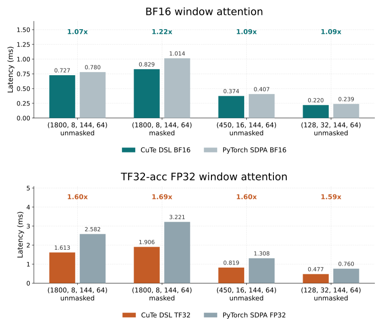
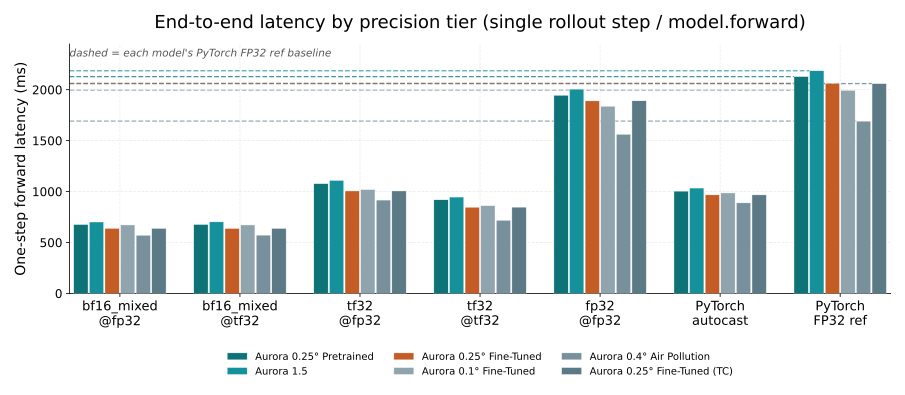
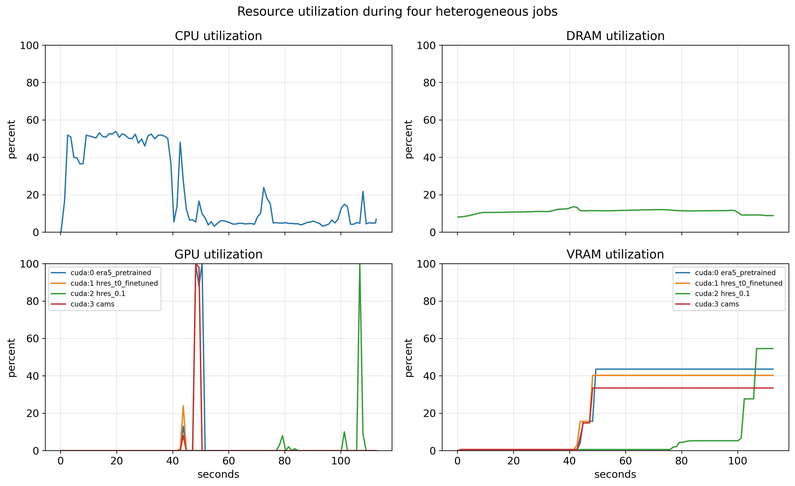
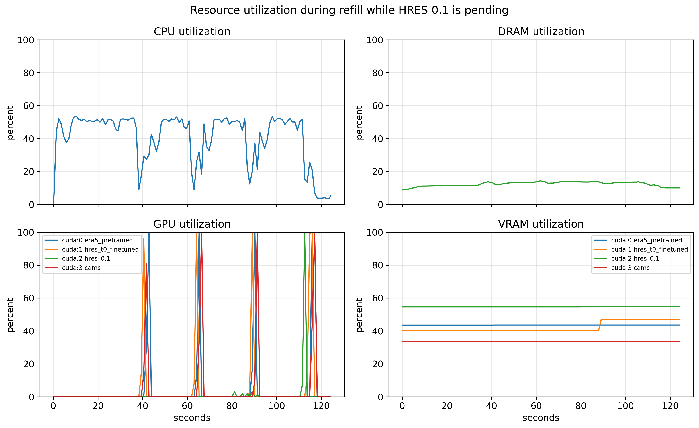
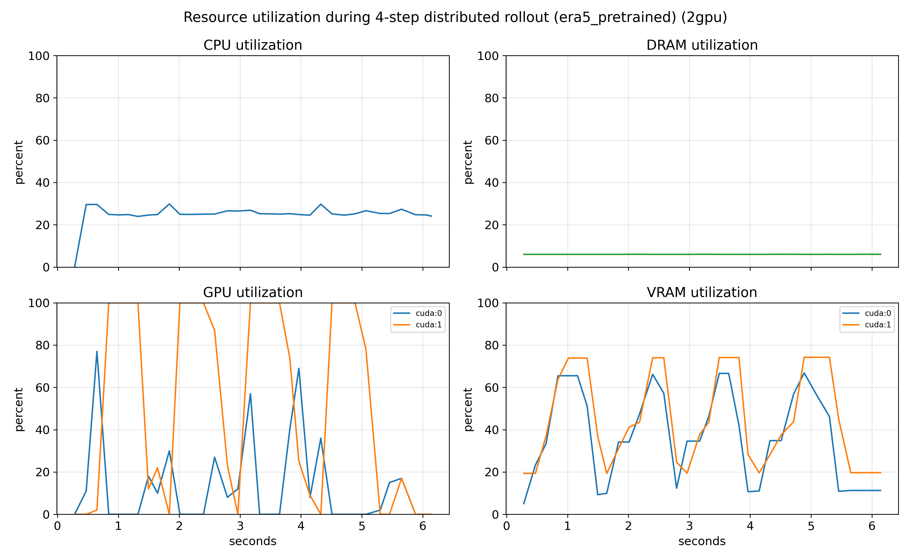
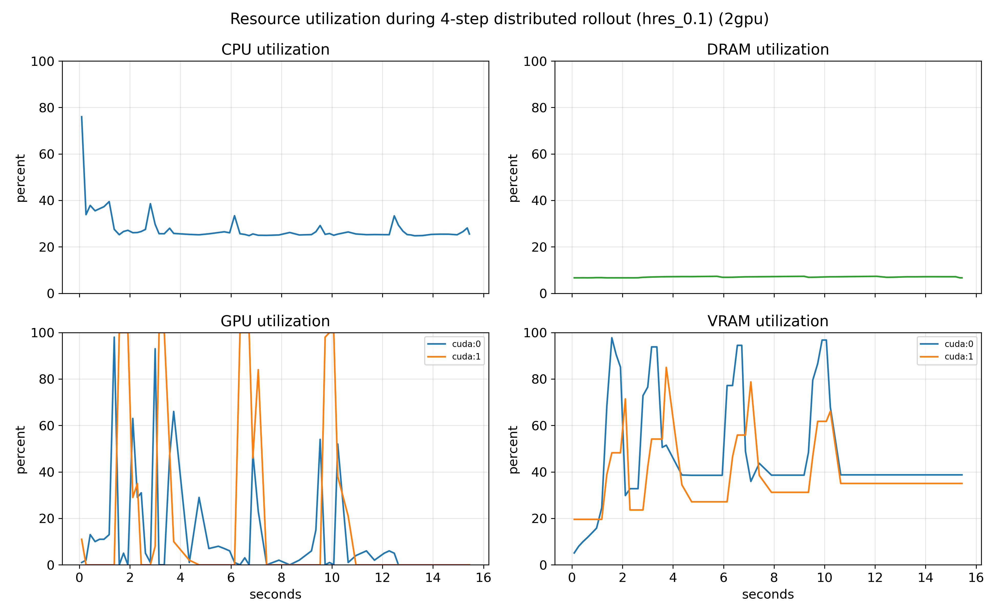

# Flash-Aurora: Toward Efficient Inference for Geospatial Foundation Models

Flash-Aurora is an inference and serving engine for the [Microsoft Aurora](https://github.com/microsoft/aurora) Earth-system foundation model, with the same stack intended to host further geospatial foundation models. It provides shape-specialized Triton and CuTe DSL kernels, named mixed-precision routing (`inference_precision`), data ingress, checkpoint loading, autoregressive rollout, NetCDF/GeoTIFF export, and a ZeroMQ scheduler to deploy asynchronized service on a GPU cluster.

Companion documents:

- [Slide deck (GitHub Pages)](https://catmanjr.github.io/Flash-Aurora-walkthrough/): interactive walkthrough of architecture, precision tiers, Engine/Scheduler workflows, and measured results.
- [docs/tutorial.md](docs/tutorial.md): install steps, Engine and scheduler API examples, notebook index.
- [docs/benchmarks.md](docs/benchmarks.md): full latency, numerical-error, window-attention, and multi-GPU rollout tables.
- [Examples](#examples): linked walkthrough notebooks for each preset, ROI export, and the ZMQ scheduler.

## Highlights

### Extensible inference and serving: Aurora 1.5 Day-1 support

New model families plug into the same Engine without rewriting the performance-critical path. In the same sense as Day-1 model support in systems such as vLLM, a modular preset / registry / adapter surface lets a new family land with shared kernels and serving, rather than a fork of the hot path. Aurora 1.5 (Microsoft Aurora release tag `v2.0.0`) is the first proof point: a side-path package beside the archived legacy family (upstream **v1.8.0**). Walkthrough: [docs/example_aurora_v1p5.ipynb](docs/example_aurora_v1p5.ipynb).

The same pattern (model package, preset, adapter; reuse Engine and kernels) is how later Aurora generations or other geospatial foundation models can get Day-1 support under a compatible code adaption.

### Kernel fusion for backbone memory traffic

PyTorch Swin3D materializes many short-lived tensors at window-layout and AdaLN boundaries. Flash-Aurora fuses those steps on the backbone hot path:

- **Fused window layout** (`triton_swin3d_layout.py`, `use_triton_layout`): cyclic shift, pad, 3D window partition, and inverse merge in fused Triton kernels instead of a chain of eager views and copies. For fixed inference shapes, `InferenceWorkspacePool` can reuse a scratch buffer for the backbone--decoder concat and related temporaries.
- **Fused AdaLN and residual** (`triton_adaln.py`, `use_triton_adaln`): LayerNorm, FiLM modulation, and residual add without writing a full-width AdaLN intermediate.

On `bf16_mixed@*` and `tf32@*` tiers, AdaLN can emit FP32 activations between Swin3D blocks (`output_fp32`), so the next block reads higher-precision residuals while GEMM and attention still use Tensor Cores. That reduces global-memory traffic relative to the decomposed PyTorch path without collapsing inter-block precision to BF16. Details: [Precision tiers](#precision-tiers).

### CuTe DSL window attention

Aurora Swin windows are short ($N = 144$ for window size $(2, 6, 12)$ on the default $0.25^{\circ}$ encoder). The kernels follow a fused multi-head attention structure: load $Q$, $K$, and $V$ into shared memory, form logits $S = \mathrm{scale}\, QK^{\top}$, apply the optional Swin mask, compute row-wise online softmax in FP32, then accumulate $O \leftarrow \mathrm{softmax}(S)V$ without materializing the full $N \times N$ matrix in global memory.

**Why short windows matter.** When $tile_n \ge N$, `_smem_utils.py` selects the **single-stage** path (`single_kv_tile=True`, `num_stages=1`): one shared-memory tile holds the entire window $K$ and $V$, then QK and PV Tensor Core MMAs run locally. There is no multi-stage $K/V$ stream and no second global round-trip for the attention map. If $N$ exceeds the SMEM budget, the code falls back to a multi-stage streaming variant (TMA double-buffering, `num_stages=2`); production $0.25^{\circ}$ inference stays on the single-stage path for $N=144$.

Two precision modes (`WinAttnPrecision`) cover the production path:

- **`BF16_MIXED`:** BF16 activations and Tensor Core MMA; FP32 online softmax.
- **`TF32_ACC_FP32`:** FP32 inputs and outputs with TF32-accumulated MMA, for closer FP32 fidelity at lower throughput than BF16.

Shifted-window masks are packed once as compact `uint8` and applied inside the kernel as the additive bias equivalent of PyTorch's $-100$ relative-position mask, so logits match `scaled_dot_product_attention` (SDPA).

Attention $Q$, $K$, and $V$ use layout $(B, H, N, D_h)$, where $B = B_{\mathrm{batch}} \cdot n_W$ folds batch and window index, $H$ is heads, $N$ is tokens per window, and $D_h$ is the head dimension ($D_h = 64$ here). The figure reports three ERA5 encoder shapes, $(1800, 8, 144, 64)$, $(450, 16, 144, 64)$, and $(128, 32, 144, 64)$, plus a shifted-window mask on $(1800, 8, 144, 64)$. On Blackwell (`sm_120`) unmasked speedups are about $1.07$--$1.09\times$ versus BF16 SDPA and about $1.59$--$1.60\times$ versus FP32 SDPA; the masked $(1800, 8, 144, 64)$ case reaches about $1.22\times$ (BF16) and $1.69\times$ (TF32). On RTX 4090 (`sm_89`) absolute latency is higher, with about $2.2\times$ versus FP32 SDPA (larger gaps versus default SDPA dispatch; forced memory-efficient SDPA is within a few percent of CuTe BF16). Full tables: [docs/benchmarks.md](docs/benchmarks.md#window-attention-microbenchmarks).

<p align="center">
  
</p>

Measured on RTX PRO 6000 Blackwell (`sm_120a`). X-axis labels are $Q/K/V$ shapes $(B, H, N, D_h)$. Masked bars apply Swin shifted-window bias $-100$.

### Mixed-precision inference

Tiers use the label `backbone@encoder_decoder` (default production tier `bf16_mixed@fp32`). The left token selects Swin3D GEMM and window-attention dtype; the right token selects Perceiver encoder/decoder GEMM dtype.

- **`bf16_mixed` backbone:** BF16 CuTe attention (QKV/proj) and BF16 MLP; TF32 Tensor Core GEMM elsewhere; FP32 inter-block activations via Triton AdaLN (`output_fp32`).
- **`tf32` backbone:** TF32 GEMM throughout Swin plus CuTe `TF32_ACC_FP32` attention (FP32 I/O).
- **`fp32` backbone:** Strict FP32 GEMM and PyTorch SDPA; accuracy baseline with Triton fusion still enabled.
- **`bf16` backbone:** Full backbone BF16 GEMM with fused CuTe attention (faster path exists, but larger drift; not recommended for production).

Encoder and Perceiver decoder default to `@fp32` because their errors map directly into output fields, while the Swin backbone dominates runtime (about $63\%$ of forward time on `era5_pretrained`). Across production presets, `bf16_mixed@fp32` brings a **single rollout step** (`model.forward`, one lead) to about $570$--$680\,\mathrm{ms}$, versus about $1.7$--$2.1\,\mathrm{s}$ for the unfused PyTorch FP32 reference (`pytorch_backbone_fp32_encoder_decoder_fp32`). These end-to-end bars are not multi-step autoregressive rollouts. Each tier is timed in a fresh subprocess (`--isolate-tiers`) so cuDNN autotune from an earlier tier cannot deflate a later baseline. Full tables: [docs/benchmarks.md](docs/benchmarks.md).

Precision tier details: [Precision tiers](#precision-tiers).

<p align="center">
  
</p>

*RTX PRO 6000 Blackwell; one `model.forward` (single rollout step) per bar; each tier in a separate process (`--isolate-tiers`). Finetuned presets merge LoRA into base weights before timing (`lora_merged`). `aurora_v1p5` is within a few percent of `era5_pretrained`; see [docs/benchmarks.md](docs/benchmarks.md).*

### Asynchronous multi-GPU serving

One long-lived ZeroMQ worker owns one GPU and one model preset. A coordinator routes jobs to idle workers and streams step events to clients. This is **job-level** scheduling across heterogeneous presets, not tensor or pipeline parallelism inside one forward. Commands and client sketches: [docs/tutorial.md](docs/tutorial.md#forecast-scheduler-deployment).

<table width="100%">
  <tr>
    <th width="50%" align="center">Single 1-step task distribution</th>
    <th width="50%" align="center">Refill while <code>hres_0.1</code> is pending</th>
  </tr>
  <tr>
    <td width="50%" valign="top"></td>
    <td width="50%" valign="top"></td>
  </tr>
</table>

Left: one job per worker and preset. Right: faster workers take follow-up jobs while `hres_0.1` remains pending. Traces from `docs/example_scheduler_distributed_workers.ipynb` on $4\times$ RTX PRO 6000 Blackwell.

### Pipeline parallelism for GPUs under $40\,\mathrm{GiB}$

`DistributedConfig` places encoder, Swin backbone, and spatial decoder on two devices **inside one process** (not a multi-process `torchrun` job). The VRAM planner in `engine/distributed/plan.py` chooses the split from `ModelVariantSpec` and per-card limits; `decoder_spatial.py` can bisect the decoder west/east so peak decoder activation memory falls from about $28\,\mathrm{GiB}$ to about $14\,\mathrm{GiB}$ per card on ERA5. On $2\times$ RTX 5090, a $4$-step `rollout_and_export` run reaches about $1.3\,\mathrm{s}$/step on `era5_pretrained` and about $3.6\,\mathrm{s}$/step on `hres_0.1`, where GPU-to-CPU offload and NetCDF write dominate (export-bound). Aurora 1.5 does not yet enable this path. Placement and timing tables: [docs/benchmarks.md](docs/benchmarks.md#distributed-pipeline).

<table width="100%">
  <tr>
    <th width="50%" align="center"><code>era5_pretrained</code> (5090)</th>
    <th width="50%" align="center"><code>hres_0.1</code> (5090)</th>
  </tr>
  <tr>
    <td width="50%" valign="top"></td>
    <td width="50%" valign="top"></td>
  </tr>
</table>

### Batched ROI mask export

In practice, application users rarely need a full global field after inference (the same pattern as clipping and exporting AOIs in Google Earth Engine). Shipping every grid cell through egress is wasteful: the dominant costs are GPU-to-CPU transfer and CPU-to-disk write for large NetCDF/GeoTIFF volumes. Flash-Aurora therefore clips on the egress path. `RoiBatch` exports several named masks from one rollout step with a *ingle GPU-to-CPU copy, then applies each mask and writes only the regional product (GeoTIFF recommended; NetCDF also supported) without re-running inference. That cuts both host memory traffic and on-disk footprint relative to a global dump. Masks come from axis-aligned bounds, GeoJSON, shapefile, or georeferenced raster; GeoTIFF defaults to Web Mercator (EPSG:3857) and handles the $0^{\circ}/360^{\circ}$ meridian. Walkthrough: [docs/example_roi_export.ipynb](docs/example_roi_export.ipynb).

## Install

```bash
git clone <repository-url>
cd flash-aurora
uv sync
```

Dependencies are listed in `pyproject.toml` and pinned in `uv.lock`. If CuTe kernels need an explicit GPU architecture, set `CUTE_DSL_ARCH` (for example `sm_89` on RTX 4090, `sm_120a` on Blackwell). API sketches: [docs/tutorial.md](docs/tutorial.md#quick-start).

## Repository layout

| Path | Role |
| ---- | ---- |
| `flash_aurora/models/aurora/` | Legacy optimized Aurora (upstream freeze **v1.8.0**). |
| `flash_aurora/models/aurora_v1p5/` | Aurora 1.5 package (`v2.0.0` release); shares kernels and precision modes. |
| `flash_aurora/models/ops/` | Shared Triton and CuTe kernels. |
| `flash_aurora/models/inference_precision.py` | Named precision presets. |
| `flash_aurora/engine/` | Preset Engine: core, ingress, egress, runtime, distributed. |
| `flash_aurora/scheduler/` | ZeroMQ worker, coordinator, client, supervisor. |
| `docs/` | Notebooks, [tutorial.md](docs/tutorial.md), [benchmarks.md](docs/benchmarks.md). |
| `benchmark/` | Latency, numerical-error, kernel, and multi-GPU timing scripts. |
| `tests/` | Model, kernel, engine, and scheduler tests (`./scripts/run_tests.sh`). |

## Reading guide

1. Run forecasts in one process: [Engine](#engine), then [docs/tutorial.md](docs/tutorial.md) or the [Examples](#examples) notebooks.
2. Fit a preset that needs two GPUs: [Distributed pipeline](#distributed-pipeline) and [docs/benchmarks.md](docs/benchmarks.md#distributed-pipeline).
3. Serve outside the notebook: [Forecast scheduler](#forecast-scheduler-zmq) and [docs/tutorial.md](docs/tutorial.md#forecast-scheduler-deployment).
4. Compare precision or latency: [Precision tiers](#precision-tiers) and [docs/benchmarks.md](docs/benchmarks.md).

## Examples

| Example | Topic |
| ------- | ----- |
| [example_era5.ipynb](docs/example_era5.ipynb) | Baseline in-process `era5_pretrained`; populate cache and checkpoints. |
| [example_aurora_v1p5.ipynb](docs/example_aurora_v1p5.ipynb) | Aurora 1.5: extended ERA5 IC, 6 h / hourly leads, optional ensemble. |
| [example_hres_t0.ipynb](docs/example_hres_t0.ipynb) | WeatherBench2 HRES T0 finetuned preset. |
| [example_hres_0.1.ipynb](docs/example_hres_0.1.ipynb) | $0.1^{\circ}$ high-resolution Aurora (`hres_0.1`). |
| [example_cams.ipynb](docs/example_cams.ipynb) | CAMS air-pollution preset. |
| [example_wave.ipynb](docs/example_wave.ipynb) | Wave preset; manual MARS GRIB cache placement when needed. |
| [example_tc_tracking.ipynb](docs/example_tc_tracking.ipynb) | Tropical-cyclone tracking LoRA preset. |
| [example_roi_export.ipynb](docs/example_roi_export.ipynb) | Batched ROI mask export (NetCDF / GeoTIFF) via `RoiBatch`. |
| [example_scheduler_single_worker.ipynb](docs/example_scheduler_single_worker.ipynb) | Single-GPU ZeroMQ queue; preflight cleanup; graceful shutdown. |
| [example_scheduler_distributed_workers.ipynb](docs/example_scheduler_distributed_workers.ipynb) | Heterogeneous multi-GPU dispatch and refill while a slow job is pending. |
| [example_scheduler.py](docs/example_scheduler.py) | Command-line version of the single-worker scheduler tutorial. |

API sketches that accompany these notebooks: [docs/tutorial.md](docs/tutorial.md).

## Engine

`flash_aurora.engine` is the preset-driven inference layer: choose a model and data source, load weights, validate the input batch, run multi-step forecasts, write NetCDF, and optionally place stages on two GPUs in one process.

### Architecture

| Layer | Path | Role |
| ----- | ---- | ---- |
| Core | `engine/core/` | Config, presets, `AuroraEngine`, checkpoints, forecast session, lifecycle. |
| Ingress | `engine/ingress/` | Downloaders, format adapters, initial-condition builder, validator, optional disk cache. |
| Egress | `engine/egress/` | Move results off GPU, name step NetCDF files, optional background export. |
| Runtime | `engine/runtime/` | Warmup, optional CUDA graph pool, GPU reservation, memory estimates. |
| Distributed | `engine/distributed/` | Two-GPU placement plan and pipelined forward. |

A preset pairs a model variant with a data profile. The downloader fills the local cache when files are missing; the initial-condition builder builds a validated batch; `load()` applies the chosen precision mode and optional two-GPU layout; `rollout_stream` advances $K$ forecast steps by the model time step $\Delta t$; with background export on, NetCDF writes can overlap the next forward.

### Presets and data sources

| Preset | Model | Grid $H \times W$ | Source | Backend |
| ------ | ----- | ----------------- | ------ | ------- |
| `era5_pretrained` | AuroraPretrained | $721 \times 1440$ | CDS ERA5 | CDS |
| `aurora_v1p5` | AuroraV1p5 | $721 \times 1440$ | CDS ERA5 (extended) | CDS |
| `aurora_v1p5_ensemble` | AuroraV1p5Ensemble | $721 \times 1440$ | CDS ERA5 (extended) | CDS |
| `hres_t0_finetuned` | Aurora (LoRA) | $721 \times 1440$ | WeatherBench2 HRES | WB2 + ERA5 static |
| `small_pretrained` | AuroraSmallPretrained | $400 \times 800$ | CDS ERA5 | CDS |
| `hres_0.1` | AuroraHighRes | $1801 \times 3600$ | IFS analysis | ECMWF Open Data / GRIB |
| `cams` | AuroraAirPollution | $451 \times 900$ | CAMS | ADS |
| `wave` | AuroraWave | $721 \times 1440$ | WB2 meteorology + MARS wave | WB2 + MARS |
| `tc_tracking` | Aurora (LoRA) | $721 \times 1440$ | WeatherBench2 HRES | WB2 + ERA5 static |

Personal ECMWF accounts typically lack MARS access; see [example_wave.ipynb](docs/example_wave.ipynb) for placing wave GRIB files in the cache by hand.

### Capabilities (summary)

Checkpoints load from disk, with optional Hugging Face Hub download. Precision modes route Triton, CuTe, BF16, and TF32 on the legacy family and the Aurora 1.5 backbone. Two-GPU pipeline placement is available for the legacy family (not for Aurora 1.5). Data sources include CDS (including Aurora 1.5 extended surface fields), ADS, WeatherBench2, Open Data GRIB, and MARS when the account allows it. Aurora 1.5 can use hourly lead times. Optional features include background NetCDF export, overlapping initial-condition load with compute, a disk cache of prepared initial conditions, and a GPU reservation guard. CUDA graph capture is still experimental and is turned off for Aurora 1.5.

API sketches and lifecycle notes: [docs/tutorial.md](docs/tutorial.md).

### Distributed pipeline

Single-process pipeline parallelism for presets that exceed one GPU. Pass `distributed=DistributedConfig(devices=("cuda:0", "cuda:1"), ...)` to `from_preset`, or set `engine.config.distributed` before `load()`. Benchmarks: [docs/benchmarks.md](docs/benchmarks.md#distributed-pipeline).

### Forecast scheduler (ZMQ)

Long-lived workers each own one GPU and one preset. Clients send JSON commands and receive per-step events (exported file paths, metadata only, or the last step as an array). Deployment commands and client sketches: [docs/tutorial.md](docs/tutorial.md#forecast-scheduler-deployment).

## Precision tiers

Tiers are labeled `backbone@encoder_decoder` (for example `bf16_mixed@fp32`).

| Backbone token | Meaning |
| -------------- | ------- |
| `fp32` | Strict FP32 GEMM; PyTorch SDPA unless a higher tier replaces window attention. |
| `tf32` | TF32 Tensor Core GEMM; CuTe `TF32_ACC_FP32` window attention (FP32 I/O). |
| `bf16_mixed` | BF16 attention QKV/proj and MLP; TF32 GEMM elsewhere; CuTe `BF16_MIXED` attention; FP32 inter-block activations via Triton AdaLN when enabled. |
| `bf16` | Full backbone BF16 GEMM with fused CuTe attention (not recommended for production). |

Encoder/decoder tokens are `fp32` or `tf32` and control Perceiver GEMM dtype. Set with `inference_precision=` on `from_preset` or `EngineConfig`.

All custom tiers enable the same Triton fusion base (`use_triton_layout`, `use_triton_adaln`). CuTe attention and GEMM precision layer on top. The reference tier `pytorch_backbone_fp32_encoder_decoder_fp32` disables Triton and CuTe so drift is measured against an unfused baseline.

Official per-variable tolerances $\tau_v$ and full drift tables: [docs/benchmarks.md](docs/benchmarks.md#official-per-variable-tolerances).

## Window attention kernels

Flash-Aurora replaces PyTorch SDPA on Swin windows with CuTe DSL kernels under `flash_aurora/models/ops/cute/`. Inputs use layout $(B, H, N, D_h)$ as above. For production $0.25^{\circ}$ shapes with $N = 144$ and $D_h = 64$, `_choose_tile_n` keeps $tile_n \ge N$ so a single SMEM tile holds $K$ and $V$ (`single_kv_tile=True`). Softmax accumulates in FP32; the full $N \times N$ map is not written to global memory. `BF16_MIXED` and `TF32_ACC_FP32` trade Tensor Core throughput against FP32 fidelity; masks are `uint8`-packed equivalents of the PyTorch $-100$ bias. Microbenchmark tables: [docs/benchmarks.md](docs/benchmarks.md#window-attention-microbenchmarks).

## Benchmarks (summary)

End-to-end figures mean a **single** `model.forward` (one rollout step), measured on NVIDIA RTX PRO 6000 Blackwell, PyTorch $2.12.1+\mathrm{cu}130$, CUDA $13.0$, and `CUTE_DSL_ARCH=sm_120a`. Each timing run warms up twice, then averages five measured forwards. **Each precision tier runs in its own process** (`--isolate-tiers`) so cuDNN autotune from an earlier tier cannot deflate a later baseline. The `wave` preset is omitted (needs MARS). Full BF16 backbone tiers (`bf16@*`) are left out of the latency charts: they are no faster than `bf16_mixed@*` and show larger numerical drift. Multi-step rollout timings live under the distributed section of [docs/benchmarks.md](docs/benchmarks.md#distributed-pipeline). Regenerate the figures with `uv run python benchmark/plot_readme_perf_charts.py`.

**`aurora_v1p5` numerical check** (seed $42$, baseline `pytorch_backbone_fp32_encoder_decoder_fp32`): recommended tiers (`bf16_mixed@*`, `tf32@*`, `fp32@fp32`) pass all $31$ output variables against the published per-variable tolerances $\tau_v$; `bf16@fp32` and plain PyTorch autocast fail on some extended surface fields.

Full latency grids, drift tables, reproduce commands, and multi-GPU numbers: [docs/benchmarks.md](docs/benchmarks.md).

## Testing notes

`test_aurora_small` compares FP64 forwards to Microsoft Hugging Face reference tensors. On recent PyTorch builds, a small drift on a few surface variables can appear even with the official `microsoft-aurora` wheel; the test still passes and emits a warning when drift exceeds upstream tolerances.

## License

This repository is licensed under the [MIT License](LICENSE).

- `flash_aurora.models.aurora` is derived from [Microsoft Aurora](https://github.com/microsoft/aurora) (MIT), frozen at upstream **v1.8.0**. See `flash_aurora/models/aurora/LICENSE.txt` and `NOTICE.md`.
- `flash_aurora.models.aurora_v1p5` is the Aurora 1.5 side path from tag `v2.0.0` (MIT). Presets: `aurora_v1p5` / `aurora_v1p5_ensemble`. See `flash_aurora/models/aurora_v1p5/LICENSE.txt` and `NOTICE.md`.
- Shared kernels live under `flash_aurora.models.ops` (see per-file headers, including NVIDIA BSD-3-Clause where noted).

## Reference

**Aurora model.** Bodnar et al., *A Foundation Model for the Earth System*, Nature (2025). [doi:10.1038/s41586-025-09005-y](https://doi.org/10.1038/s41586-025-09005-y). Upstream: [microsoft.github.io/aurora](https://microsoft.github.io/aurora).

**CUTLASS / CuTe DSL.** Window-attention and dense GEMM kernels under `flash_aurora/models/ops/cute/` adapt patterns from [NVIDIA CUTLASS](https://github.com/NVIDIA/cutlass) (BSD-3-Clause). Runtime package: `nvidia-cutlass-dsl`.

**Flash Attention.** FMHA mainloop and online softmax structure follow [flash-attn](https://github.com/Dao-AILab/flash-attention) (Tri Dao).
