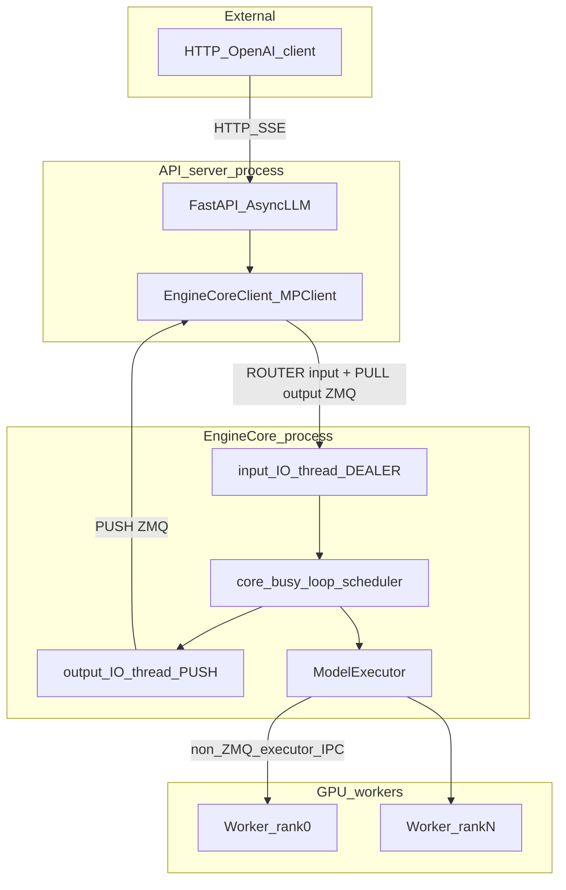

# vLLM client–server–worker ZMQ communication

This note records how vLLM V1 uses ZeroMQ between the API frontend and
`EngineCore`, and what flash-aurora should (and should not) copy for local
scheduler serving. Upstream references:
[arch overview](https://github.com/vllm-project/vllm/blob/main/docs/design/arch_overview.md),
[`core_client.py`](https://github.com/vllm-project/vllm/blob/main/vllm/v1/engine/core_client.py),
[`core.py`](https://github.com/vllm-project/vllm/blob/main/vllm/v1/engine/core.py),
[`engine/utils.py`](https://github.com/vllm-project/vllm/blob/main/vllm/v1/engine/utils.py).

## Naming

In vLLM V1, **worker** usually means a GPU executor process, not the ZMQ peer of
the HTTP client. ZMQ sits on the **frontend ↔ EngineCore** boundary. GPU workers
talk to EngineCore through the executor stack (`multiprocessing` /
`torch.distributed` / shared tensors), not the request/response ZMQ pair.

| Everyday name | vLLM V1 object | Transport |
|---|---|---|
| Client / server front | API server + `EngineCoreClient` (`MPClient` / `AsyncMPClient`) | HTTP outside; ZMQ to core |
| Server / engine | `EngineCoreProc` | ZMQ + internal queues |
| Worker | GPU worker under `Executor` | Not the main ZMQ request path |

## Frontend ↔ EngineCore (ZMQ)

### Socket roles

Frontend (`MPClient`) **binds**:

- **Input:** `zmq.ROUTER` — multiplexes engine identities; multipart send to a peer.
- **Output:** `zmq.PULL` — receives streamed `EngineCoreOutputs`.

Each `EngineCoreProc` **connects**:

- **Input IO thread:** `zmq.DEALER` with fixed `IDENTITY` → frontend ROUTER.
- **Output IO thread:** `zmq.PUSH` → frontend PULL.

ROUTER/DEALER on the input path supports many EngineCores, identity routing, and
elastic reconnect (`ROUTER_HANDOVER`). Frontend binds and engines connect so the
engine cannot race ahead of a listening frontend
([PR #15906](https://github.com/vllm-project/vllm/pull/15906)).

### Addresses and handshake

`EngineZmqAddresses` holds per-frontend `inputs` / `outputs`, plus optional DP
coordinator endpoints. Local paths use `ipc://`; multi-node uses
`tcp://host:0` placeholders resolved via `zmq.LAST_ENDPOINT`.

Startup on a separate DEALER handshake socket:

1. Engine sends `{status: HELLO, local, headless}` (msgpack).
2. Frontend replies with `EngineHandshakeMetadata` (addresses + parallel config).
3. Engine starts IO threads; each DEALER sends `b""` so ROUTER learns the peer.
4. After KV init, engine sends `READY` (GPU blocks, DP hash, stats address).
5. Only then is the engine schedulable.

### Runtime path

IO threads never share the GPU busy loop:

1. Input thread: poll DEALER(s) → decode → `input_queue`.
2. Busy loop: drain queue, schedule, executor `step`.
3. Output thread: `output_queue` → msgpack encode → PUSH (`ENGINE_CORE_DEAD` uses linger).

Wire format is msgspec msgpack, often multipart `[RequestType, ...frames]`.

## EngineCore ↔ GPU workers

One process per accelerator (`TP × PP` per engine core). Transport is
executor-specific (NCCL, shared memory, Ray). Do not map Aurora pipeline GPUs
onto this ZMQ pattern; use `DistributedConfig` instead.

## flash-aurora contrast

| Dimension | vLLM V1 | flash-aurora |
|---|---|---|
| Process split | API ≠ EngineCore ≠ GPU workers | Client/Coordinator ≠ Worker; Engine in-worker |
| Input sockets | ROUTER bind ← DEALER connect | PULL bind ← PUSH connect |
| Output sockets | PULL bind ← PUSH connect | PUSH bind ← PULL connect |
| Multiplexing | Identity + many engines | Coordinator queue + `sticky_key` |
| Handshake | HELLO/INIT/READY + port resolve | Bind + explicit `ready` after optional `load()` |
| Codec | msgspec msgpack | JSON control plane |
| IO vs compute | ZMQ threads + queues | Worker poll loop (forecast still blocks accept) |

Aurora already uses an asymmetric command/event pair. It does not need
ROUTER/DEALER or msgpack for single-GPU localhost serving.

## Lessons applied in flash-aurora

1. Keep heavy Engine work in the worker process (off the client accept path).
2. Worker binds; clients connect; advertise resolved `LAST_ENDPOINT` addresses.
3. Emit an explicit `ready` event after optional `engine.load()` before treating
   the worker as warm; late clients can re-check via `health` / `wait_for_ready`.
4. Prefer `ipc://` under a socket directory or `tcp://127.0.0.1:0` for local demos.
5. Keep PUSH/PULL + coordinator; do not port DP coordinator / ROUTER unless
   multi-engine fan-in is required.
6. Keep JSON for control; large arrays stay on the existing event payload path.

See also: [Forecast scheduler deployment](../tutorial.md#forecast-scheduler-deployment)
and `python -m flash_aurora.scheduler.localhost`.
